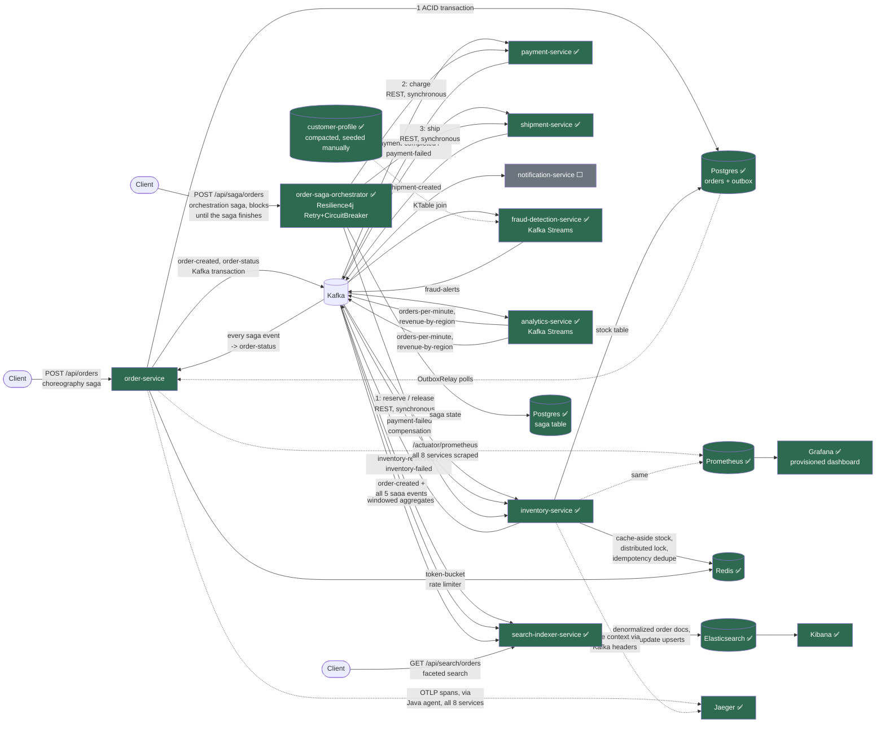

# OrderFlow

A hands-on Kafka + distributed-systems tutorial disguised as an e-commerce
order pipeline. Every file in this repo teaches something on purpose — read
the class-level Javadoc for *why* a decision was made, and the
`🎓 CONCEPTS LEARNED IN THIS FILE` block at the bottom of every source file
for a recap plus a `🔧 TRY IT YOURSELF` exercise. This isn't just sample
code to run — treat each file as a lesson with a lab attached.

This repo is built incrementally, following the Build Order below. Each
step is a real git-history-worthy milestone: a working, demonstrable
increment, not a half-finished sketch of the next one. Since Step 10,
that also means a real feature branch + pull request per step — see
[`docs/git-github-workflow.md`](docs/git-github-workflow.md) for a full
staged walkthrough of that workflow (branching, committing, an actual
interactive rebase, PR review, and the merge-vs-squash-vs-rebase
decision) using this repo's own real history as worked examples, plus a
git/GitHub reference section and an interview-style Q&A at the end.

For the requirements/architecture/trade-offs view of this whole project
— what got built, what got deliberately scoped out, and why — see
[`docs/system-design.md`](docs/system-design.md).

Everything above is local — `docker-compose.yml` + `mvn spring-boot:run`,
one machine. A separate, additive effort deploys this same platform to
real AWS infrastructure (ECS, a genuine multi-broker Kafka cluster) to
close the two gaps a single-broker local setup can never honestly
demonstrate — broker failure/ISR/leader-election, and real
multi-machine throughput numbers. See
[`docs/aws-cloud-deployment.md`](docs/aws-cloud-deployment.md), written
as a from-scratch, phase-by-phase build log for anyone who (like this
project's own author, going in) doesn't yet know AWS CDK/ECS.

## Where we are right now

**Build Order Steps 1–11 are done:** `order-service` publishes to Kafka;
`inventory-service` consumes, checks in-memory stock, and logs a
reservation decision (Step 1) — scales horizontally with a rebalance
listener that logs partition hand-off as instances join, leave, or crash
(Step 2) — the event contract is Avro, enforced by Schema Registry,
instead of two hand-copied JSON DTOs (Step 3) — a genuinely broken
message retries with exponential backoff across dedicated retry topics
before landing on a Dead Letter Topic, instead of blocking its partition
forever (Step 4) — order-service has a real database, writing to
Postgres and Kafka atomically-enough via the transactional outbox
pattern (Step 5) — every order gets scored for fraud in real time by
`fraud-detection-service`, OrderFlow's first Kafka Streams app, combining
a stateless rule engine, a KStream-KTable enrichment join, a stateful
windowed velocity check, exactly-once-v2 processing, and a live
interactive-queries endpoint (Step 6) — `analytics-service`, the
second Kafka Streams app, computes two live windowed business metrics
(global orders/min, revenue by region) by re-keying the same
`order-created` stream via `groupBy`, publishing both back out as their
own retention-based topics (Step 7) — and the order pipeline now runs as
a genuine distributed saga, built and tested TWO ways side by side: a
choreography saga where `payment-service` and `shipment-service` (both
new) react to each other's Kafka events with no coordinator at all, and
an orchestration saga where a new `order-saga-orchestrator` service calls
all three downstream services directly and synchronously over REST,
wrapped in Resilience4j `@CircuitBreaker` + `@Retry` — both with a real,
live-tested compensating-transaction path when payment is declined
(Step 8) — and Redis now backs four previously-documented gaps:
inventory-service's stock moved from an in-memory map to Postgres with a
genuine cache-aside read layer in front of it, a Redis distributed lock
closes the overselling race condition that was reproducible since Step 1
(verified live across TWO real inventory-service instances), an
idempotent-consumer dedupe store makes message redelivery actually safe
instead of just documented as unsafe, and order-service's REST API is now
rate-limited per customer with a token bucket implemented as an atomic
Redis Lua script (Step 9) — and a new `search-indexer-service` now builds
one denormalized Elasticsearch document per order from `order-created`
plus all five saga events via partial-update upserts, answering faceted
searches ("orders for customer X in region Y with status Z") no single
existing service could, plus a second independent consumer feeding
analytics-service's windowed aggregates into Elasticsearch for Kibana
(Step 10) — and every service is now genuinely observable instead of
just logging to a terminal nobody's watching: Micrometer + Prometheus
metrics on all 8 services (consumer lag as a first-class monitored
metric, exactly as claude.md asks — including a real gap found and fixed
live, where inventory-service's hand-built consumer factory was silently
missing the lag binding every OTHER service got for free), a committed
Grafana dashboard provisioned automatically on startup, a real Prometheus
counter closing the "dead-letter-topic alerting story" instead of only a
log line, and OpenTelemetry distributed tracing via the Java
auto-instrumentation agent — verified live with a single trace spanning
all 7 downstream services and 51 spans for ONE order, trace context
correctly propagated through Kafka headers the whole way (Step 11).
Everything else below is roadmap.

## Target architecture



✅ = built · ⬜ = planned (see Build Order). The two Prometheus/Jaeger
arrows shown are representative — in reality ALL 8 services are scraped
and ALL 8 export traces; drawing all 16 arrows would make the diagram
unreadable. Two separate client entry points on purpose — choreography
(`order-service`) and orchestration
(`order-saga-orchestrator`) run side by side, never touching the same
order, so you can compare them directly. See "Running Step 8 yourself"
below.

## Build Order (the tutorial's spine)

This is the order the codebase is grown in, taken directly from the
project's requirements doc (`claude.md`). Don't skip ahead in the code —
each step deliberately leaves a rough edge that the NEXT step exists to
fix, and the comments point that out explicitly as you go.

- [x] **1. Single producer/consumer, plain JSON** — order-service →
      inventory-service, basic flow working end-to-end.
- [x] **2. Consumer groups + manual offset commits** — scale
      inventory-service horizontally, watch rebalancing happen.
- [x] **3. Avro + Schema Registry** — replace the hand-copied JSON DTOs
      with a real, enforced contract; demonstrate schema evolution.
- [x] **4. Retry topics + Dead Letter Topics** — handle poison messages
      with exponential backoff instead of retrying forever.
- [x] **5. Kafka transactions + the outbox pattern** — order-service
      writes to Postgres and Kafka without the dual-write problem.
- [x] **6. fraud-detection-service** — a Kafka Streams app (stateless,
      then stateful), plus a KStream-KTable join and interactive queries.
- [x] **7. analytics-service** — windowed aggregations (`groupBy`
      re-keying, global count, per-region sum) + interactive queries.
- [x] **8. Saga pattern** — choreography (payment-service +
      shipment-service react to Kafka events, no coordinator) AND
      orchestration (`order-saga-orchestrator`, synchronous REST +
      Resilience4j), built and live-tested side by side, each with a real
      compensating-transaction path.
- [x] **9. Redis** — cache-aside for stock (Postgres now backs
      inventory-service's stock table, Redis reads through it),
      idempotent-consumer dedupe store, per-customer token-bucket rate
      limiting on order-service's API, and a distributed lock that fixes
      the overselling race condition reproducible since Step 1 — verified
      live across two real inventory-service instances.
- [x] **10. Elasticsearch** — `search-indexer-service` builds one
      denormalized order document per orderId from `order-created` plus
      all five saga events, via partial-update upserts; `GET
      /api/search/orders` answers faceted queries no other service can;
      a second consumer feeds analytics-service's windowed aggregates
      into Elasticsearch for Kibana. Two real bugs found and fixed live:
      an index-mapping gap (annotations silently ignored until an
      explicit index initializer existed) and a genuine concurrent-writer
      version conflict under backfill load, fixed with Elasticsearch's
      own retry-on-conflict.
- [x] **11. Observability** — Micrometer + Prometheus on all 8 services
      (consumer lag as a first-class metric), a committed/provisioned
      Grafana dashboard, a real DLT-alerting counter, and OpenTelemetry
      distributed tracing via the Java auto-instrumentation agent —
      verified live with a single trace spanning all 7 downstream
      services (51 spans) for one order, propagated correctly through
      Kafka headers the whole way. Two real gaps found and fixed live:
      inventory-service's hand-built ConsumerFactory was silently missing
      Micrometer's lag binding, and Grafana's file-based dashboard
      provisioner only scans once at container startup, not on the
      documented polling interval.
- [x] **12. Full docker-compose + per-module READMEs mapping code to
      concepts** — every block in `docker-compose.yml` is now active
      infrastructure genuinely used by at least one service (only
      Debezium/kafka-connect stays commented out, on purpose, as the
      outbox-relay alternative this project deliberately didn't build).
      A true cold-start test (`docker compose down` with no `-v`, then
      `up -d` again) surfaced a real bug: the `kafka-data` volume was
      mounted at `/var/lib/kafka/data`, but `apache/kafka:3.8.0` actually
      writes its log segments to `/tmp/kafka-logs` by default — meaning
      every topic and every consumer-group offset had been silently
      non-persistent, for the entire project, until now. Fixed with an
      explicit `KAFKA_LOG_DIRS` override, then verified live: recreated
      the Kafka container a second time and confirmed all 17 topics (plus
      registered Avro schemas) survived without any service needing to
      recreate them.
- [x] **13. System design doc** — requirements, architecture diagrams
      (system + one order's full data flow), a `claude.md`-vs-reality
      traceability table for every Kafka/system-design concept, a
      trade-offs deep dive (partition key choice, choreography vs.
      orchestration, exactly-once vs. at-least-once, outbox vs. Debezium,
      retention vs. compaction, pessimistic vs. optimistic concurrency),
      and — matching this whole project's stated honesty bar — a
      dedicated "known gaps" section naming exactly what `claude.md` asks
      for that never got built (no automated tests anywhere being the
      biggest one). See
      [`docs/system-design.md`](docs/system-design.md).
- [x] **14. Testcontainers integration tests for the core order flow** —
      directly closes the biggest gap Step 13's doc named. One
      `CoreOrderFlowIntegrationTest` per saga service (order-service,
      inventory-service, payment-service, shipment-service), each
      against REAL Testcontainers-managed Kafka/Postgres/Redis, chained
      by real Kafka messages rather than one mega-test spanning multiple
      services' Spring contexts (see `docs/system-design.md`'s note on
      why). Covers the full choreography happy path AND the
      payment-declined compensation path — 6 tests, all passing. Found
      and fixed a real environment bug along the way: Testcontainers
      1.19.8 (Spring Boot 3.3.5's managed version) hardcodes its initial
      Docker-daemon probe to API version 1.32, which a newer Docker
      Desktop responded to with a malformed empty-fields response —
      fixed by overriding `testcontainers.version` to 1.21.4, whose
      probe negotiates a modern API version instead.
- [x] **15. Kafka Streams unit tests** — `fraud-detection-service` and
      `analytics-service` both already depended on
      `kafka-streams-test-utils` (declared since the reactor's original
      build, never used) — `TopologyTestDriver` runs each topology's
      actual DSL in-process, no broker at all, a genuinely different
      testing tier from Step 14: milliseconds per test instead of
      seconds waiting on Kafka. 10 tests total. fraud-detection-service's
      6 cover both branches — the leftJoin-vs-inner-join behavior the
      topology's own Javadoc calls out (an order for a customer with NO
      profile still gets evaluated), severity escalation, and the exact
      threshold-crossing point of the windowed velocity count (3rd order
      doesn't fire, 4th does). analytics-service's 4 prove `.groupBy(...)`
      genuinely re-keys (a global count blind to region, a per-region sum
      that's NOT one shared bucket) and that windows genuinely reset
      instead of accumulating forever.
- [x] **16. search-indexer-service tests** — real Testcontainers Kafka
      AND Elasticsearch, closing another of Step 13's named gaps. Five
      tests: the full happy-path saga building one Elasticsearch document
      incrementally across four partial updates (with the FIRST event's
      fields confirmed to survive three later, unrelated merges); the
      inventory-failed path; the faceted search endpoint; the second
      indexer's full-document save behavior — and one that doesn't hide
      this module's own documented "cross-topic reordering" limitation
      but reproduces it directly as a real, passing assertion: publishing
      `shipment-created` before `order-created` for the same order and
      confirming the exact status regression (`SHIPPED` back to
      `CREATED`) the module's README already described in prose. The bug
      stays unfixed on purpose — the test exists so it can't silently get
      worse unnoticed.
- [x] **17. order-saga-orchestrator tests** — closes the last named gap
      from Step 13's doc. Real Testcontainers Postgres for the actual
      `saga` table, plus ONE WireMock server standing in for all three
      downstream services (no path collisions between
      `/internal/reserve`, `/internal/charge`, `/internal/ship`,
      `/internal/release`). Five tests: the happy path; payment declined
      genuinely triggering `/internal/release` with the right orderId
      (verified against WireMock's own request log); inventory declined
      failing immediately with zero compensation or payment attempts; a
      WireMock Scenario proving `@Retry` actually retries (fail, fail,
      succeed on the 3rd attempt); and a test asserting against the real
      `CircuitBreakerRegistry` bean's state (`CLOSED` → `OPEN`) after
      sustained failures, then confirming a further call makes NO
      additional HTTP request at all. Found and fixed a real WireMock/JDK
      HttpClient interop bug along the way: WireMock's Jetty-based server
      answered the JDK HttpClient's default h2c cleartext-upgrade attempt
      with a raw `RST_STREAM`, failing every stubbed call at the
      transport level — fixed with `http2PlainDisabled(true)`, a
      WireMock-specific quirk unrelated to the real services this test
      stands in for (Tomcat doesn't negotiate h2c by default either).
- [x] **18. Avro schema-compatibility contract test** — the very last
      gap Step 13's doc named. Turns the manual `curl` checks from
      "Running Step 3 yourself" below into a real, automated test: real
      Testcontainers Kafka + Schema Registry, reading the ACTUAL
      `avro-schemas/order-created.avsc` file off disk rather than a
      hardcoded copy. Three tests, matching the three real, live-verified
      results from Step 3 — adding an optional field with a default is
      backward compatible; removing a field entirely is ALSO backward
      compatible (the genuinely surprising result); adding a required
      field with no default is the one that's actually rejected, with
      Schema Registry's own `READER_FIELD_MISSING_DEFAULT_VALUE` reason
      verified in the response, not just a boolean. Found and fixed a
      real container-ordering bug: two Testcontainers `@Container` fields
      start in parallel by default, and Schema Registry's own startup
      script failed to resolve Kafka's container network alias because
      it tried before Kafka had finished starting — fixed with an
      explicit `.dependsOn(kafka)`. *(you are here)*

## Running Step 1 yourself

```bash
# 1. Start Kafka + Kafka UI
docker compose up -d

# 2. In one terminal
cd order-service && mvn spring-boot:run

# 3. In another terminal
cd inventory-service && mvn spring-boot:run

# 4. Place an order
curl -s -X POST localhost:8080/api/orders \
  -H "Content-Type: application/json" \
  -d '{"customerId":"cust-1","region":"us-east","items":[{"productId":"sku-42","quantity":2}]}'
```

Watch inventory-service's console — you'll see it receive the event and
log a reservation decision. Browse `http://localhost:8081` (Kafka UI) to
see the `order-created` topic, its partitions, and the
`inventory-service-group` consumer group's offsets.

## Running Step 2 yourself (scaling + rebalancing)

```bash
# 1 & 2 as above: docker compose up -d, then start order-service

# 3. Start inventory-service TWICE, in two separate terminals
cd inventory-service && mvn spring-boot:run     # terminal A
cd inventory-service && mvn spring-boot:run     # terminal B

# Each terminal prints a startup banner with its own client.id.
# Watch both terminals log 🔀 ASSIGNED — the topic's 3 partitions split
# between them (e.g. 2-and-1), never overlapping.

# 4. Place a few orders with different customerIds so they land on
#    different partitions
curl -s -X POST localhost:8080/api/orders -H "Content-Type: application/json" \
  -d '{"customerId":"cust-1","region":"us-east","items":[{"productId":"sku-42","quantity":1}]}'
curl -s -X POST localhost:8080/api/orders -H "Content-Type: application/json" \
  -d '{"customerId":"cust-9","region":"eu-west","items":[{"productId":"sku-42","quantity":1}]}'

# 5. Find one instance's PID and hard-kill it (simulates a crash, not a
#    graceful shutdown)
jps -l | grep InventoryServiceApplication
kill -9 <pid>

# The surviving terminal logs 🔀 REVOKED (graceful) then 🔀 ASSIGNED with
# ALL partitions back. Notice it does NOT log LOST — we assumed it would
# until we actually tried this. LOST only fires on a client's OWN
# consumer, when THAT client gets fenced out before it can revoke
# cleanly (e.g. its own listener stalled past max.poll.interval.ms) — not
# as a notification about a peer's death. See KafkaConsumerConfig's
# onPartitionsLost Javadoc for how to trigger a real one.
#
# Place another order — it's still processed by the survivor. Nothing was
# lost, only briefly delayed while the rebalance completed.
```

See `inventory-service/README.md` for the full step-by-step (including
adding a third instance, and the static-group-membership contrast
exercise). For a deeper staged walkthrough of everything happening under
the hood across the whole lifecycle — spin up, scale out, an instance
dying, AND that instance rejoining — down to individual protocol
messages (JoinGroup, SyncGroup, generations, offset resolution), plus a
"twisted interview questions" quiz to check your understanding, see
[`inventory-service/docs/consumer-group-lifecycle.md`](inventory-service/docs/consumer-group-lifecycle.md).

## Running Step 3 yourself (Avro + Schema Registry)

```bash
# 1. Bring up infra (now includes Schema Registry on :8085)
docker compose up -d

# 2. Start both services as usual
cd order-service && mvn spring-boot:run
cd inventory-service && mvn spring-boot:run

# 3. Place an order, same as always
curl -s -X POST localhost:8080/api/orders -H "Content-Type: application/json" \
  -d '{"customerId":"cust-1","region":"us-east","items":[{"productId":"sku-42","quantity":2}]}'

# 4. Confirm the schema actually got registered
curl -s http://localhost:8085/subjects
# -> ["order-created-value"]
```

### The schema evolution demo (verified live, not hypothetical)

We added a new `giftMessage` field with a default to
`/avro-schemas/order-created.avsc`, then:

1. Rebuilt **only** order-service: `mvn -pl order-service compile`
   (`inventory-service`'s already-compiled classes were left completely
   untouched — confirmed by grepping its generated source for the new
   field and finding nothing).
2. Restarted **only** order-service. Left inventory-service's already-
   running JVM alone — it never restarted, never recompiled, and still
   has the OLD (v1) generated `OrderCreatedEvent` class loaded in memory.
3. Placed a new order through the v2 order-service.

Real result:

```
order-service (v2):
  Published order-created orderId=128e01c3... -> partition=1 offset=0

inventory-service (still running OLD v1-compiled code, never restarted):
  📥 Received order-created orderId=128e01c3... customerId=cust-evolution-1 region=apac
  📦 Reserved 1 x sku-42 for order 128e01c3...
  ✅ Order 128e01c3... fully reserved.
```

```bash
curl -s http://localhost:8085/subjects/order-created-value/versions
# -> [1,2]      both schema versions now on file
```

The old-compiled consumer read a message carrying a field it has never
heard of, and just... worked. That's Avro's schema resolution: the
reader's schema (v1) doesn't ask for `giftMessage`, so it's silently
dropped. No crash, no restart, no code change required on the consumer
side. THIS is the concrete payoff for the extra Avro/Schema Registry
machinery over Steps 1-2's plain JSON.

### The breaking-change demo (also verified live)

Before assuming what counts as "breaking," we tested two changes directly
against Schema Registry's `/compatibility` endpoint — no code touched,
completely safe against the running pipeline:

```bash
# Attempt 1: remove the required "region" field entirely
curl -s -X POST http://localhost:8085/compatibility/subjects/order-created-value/versions/latest \
  -H "Content-Type: application/vnd.schemaregistry.v1+json" \
  --data '{"schema": "...schema without region..."}'
# -> {"is_compatible":true}

curl -s -X POST localhost:8080/api/orders -H "Content-Type: application/json" \
  -d '{"customerId":"cust-1","items":[{"productId":"sku-42","quantity":2}]}'
```

That result surprised us — we assumed removing a required field would be
rejected. It isn't: under BACKWARD compatibility (the default), a new
reader schema is allowed to simply not ask for a field the old writer
data has; Avro just ignores it. Removing fields is safe. **Adding** a
required field with no default is the actual breaking case:

```bash
# Attempt 2: add "priority" as a REQUIRED field, no default
curl -s -X POST "http://localhost:8085/compatibility/subjects/order-created-value/versions/latest?verbose=true" \
  -H "Content-Type: application/vnd.schemaregistry.v1+json" \
  --data '{"schema": "...schema with required priority..."}'
# -> {"is_compatible":false,"messages":["{errorType:'READER_FIELD_MISSING_DEFAULT_VALUE',
#     description:'The field '\''priority'\'' at path '\''/fields/3'\'' in the new schema
#     has no default value and is missing in the old schema', additionalInfo:'priority'}", ...]}

curl -s -X POST localhost:8080/api/orders -H "Content-Type: application/json" \
  -d '{"customerId":"cust-1","items":[{"productId":"sku-42","quantity":2}]}'

```

This is Schema Registry actually doing its job: rejecting, with a
specific machine-readable reason, a change that would have broken any
consumer still running the previous schema — the exact silent-drift
failure mode Steps 1-2's hand-copied JSON DTOs had no defense against.

## Running Step 4 yourself (retry topics + Dead Letter Topic)

```bash
# 1 & 2 as always: docker compose up -d, start order-service, start inventory-service

# 3. Place a NORMAL order first — confirm nothing regressed
curl -s -X POST localhost:8080/api/orders -H "Content-Type: application/json" \
  -d '{"customerId":"cust-1","region":"us-east","items":[{"productId":"sku-42","quantity":1}]}'

# 4. Now place a POISON order — "sku-poison" makes OrderEventListener
#    throw on purpose (see its Javadoc)
curl -s -X POST localhost:8080/api/orders -H "Content-Type: application/json" \
  -d '{"customerId":"cust-poison","region":"us-east","items":[{"productId":"sku-poison","quantity":1}]}'
```

Real captured output from running exactly this (timestamps trimmed to
just the seconds):

```
:49.491  main topic     📥 Received order-created ... (1st attempt)
:50.622  retry-0        📥 Received order-created ... (+1.1s)
:52.635  retry-1        📥 Received order-created ... (+2.0s)
:56.639  retry-2        📥 Received order-created ... (+4.0s)
:57.191  DLT handler    💀 DEAD LETTER: order ... exhausted all retry attempts —
                         Listener failed; Simulated processing failure for order ...
```

That's the configured `1s / 2s / 4s` exponential backoff, exactly, across
4 total attempts (1 original + 3 retries) before the message lands on
`order-created-dlt`. The normal order placed in step 3 processed and
acknowledged completely normally, at the same time — one poison message
did NOT block anything else on the topic, which is the entire point
versus Steps 1-2's "same message retried forever, blocking its
partition" behavior.

```bash
docker exec orderflow-kafka /opt/kafka/bin/kafka-topics.sh \
  --bootstrap-server localhost:9092 --list
# -> order-created, order-created-retry-0, order-created-retry-1,
#    order-created-retry-2, order-created-dlt   (auto-created)

curl -s http://localhost:8085/subjects
# -> each retry/DLT topic ALSO registers its own schema subject:
#    order-created-value, order-created-retry-0-value, ..., order-created-dlt-value
```

That last part surprised us — we hadn't planned on 4 extra schema
subjects existing per topic family. Schema Registry's default
`TopicNameStrategy` derives the subject name straight from the topic
name, so republishing to a differently-named topic always means a
differently-named subject too, whether you think of it as "the same
event" or not. See `OrderEventListener.java`'s concept footer for more of
what we found running this, including that retry/DLT topics default to 1
partition regardless of the main topic's 3 — a real interaction with
Step 2's horizontal scaling worth knowing about before you rely on it in
production.

## Running Step 5 yourself (outbox pattern + Kafka transactions)

```bash
# 1. Bring up infra — now includes Postgres on :5432
docker compose up -d

# 2. Start both services as usual
cd order-service && mvn spring-boot:run
cd inventory-service && mvn spring-boot:run

# 3. Place an order, same as always
curl -s -X POST localhost:8080/api/orders -H "Content-Type: application/json" \
  -d '{"customerId":"cust-1","region":"us-east","items":[{"productId":"sku-42","quantity":2}]}'

# 4. Watch it land in Postgres, then get relayed within ~500ms
docker exec orderflow-postgres psql -U orderflow -d orderflow -c "SELECT * FROM orders;"
docker exec orderflow-postgres psql -U orderflow -d orderflow -c "SELECT * FROM outbox;"
# The outbox row disappears once OutboxRelay has published it — watch
# order-service's log for the 📤 line, then check inventory-service's
# console the same way you always have.
```

### The crash-resilience test (verified live, not hypothetical)

This is the actual payoff of the whole step, so we ran it for real rather
than just describing it:

1. Started order-service with `OUTBOX_RELAY_POLL_INTERVAL_MS=3600000` (1
   hour) — an environment-variable override of
   `outbox.relay.poll-interval-ms` — so there was zero chance the relay
   would run during the test window.
2. Placed an order, then **hard-killed order-service (`kill -9`)
   immediately after** — before the relay could possibly have published
   anything.
3. Confirmed with order-service completely dead:
   ```
   orders table:  1 row — the order IS there
   outbox table:  1 row — still unpublished
   inventory-service's log: nothing — this order was never seen
   ```
   The order survived a total crash of the only service that knew about
   it. That's not a claim, that's a `SELECT * FROM orders;` against a
   database with no application connected to it at all.
4. Restarted order-service normally (default 500ms poll interval). Real
   captured result:
   ```
   23:44:23  Started OrderServiceApplication
   23:44:24  📤 Relayed outbox row id=2 -> order-created + order-status
             for orderId=f1a6056f-...        (350ms after startup)
   23:44:24  inventory-service: 📥 Received order-created orderId=f1a6056f-...
             📦 Reserved 3 x sku-42
             ✅ Order fully reserved.
   ```
   The "lost" order wasn't lost. It was exactly where OutboxWriter left
   it, and the moment order-service came back — no manual intervention,
   no replay tooling, nothing — it flowed through the pipeline like
   nothing had happened.

Compare this honestly against Steps 1-4: on THOSE, the exact same crash —
order-service dying between "decided to publish" and "Kafka actually got
it" — meant that order was gone. No database had it. Nothing would ever
retry it. Step 5 is the fix, and this is what the fix looks like actually
working, not just architecturally sound on paper.

### Debezium CDC — the alternative Build Order Step 5 also names

`claude.md` calls out Debezium as worth comparing against the polling
relay we built. We didn't stand it up (see docker-compose.yml's commented
`kafka-connect` block for what it would take), but the trade-off is worth
being explicit about:

| | Polling `OutboxRelay` (what we built) | Debezium CDC |
|---|---|---|
| How it notices new outbox rows | Polls Postgres on a timer | Tails Postgres's write-ahead log directly |
| Latency | Up to `poll-interval-ms` (500ms here) | Near-instant — reacts to WAL entries as they're written |
| Extra infrastructure | None — it's a Java class in order-service | Kafka Connect + a Debezium connector, a whole extra deployable |
| What you own and can debug | All of it — plain JDBC, plain scheduling | Less app code, but a black-box connector's failure modes become yours to learn |
| Postgres config required | None | `wal_level=logical` — not the default, a real operational change |

Neither is "correct" — polling is simpler to own and reason about; CDC is
lower-latency and removes the outbox table's polling entirely (Debezium
can even read the outbox table directly and route its rows to the right
topic via its own Outbox Event Router transform). Worth trying once
you've internalized why the polling version works, per the comment in
docker-compose.yml.

### Correction, found during Step 6

`OutboxRelay` originally keyed BOTH `order-created` and `order-status` by
`orderId`. That's correct for `order-status` (compaction should keep the
latest status per ORDER) but silently broke `order-created`'s Step 1
promise — "same customerId, same partition, ordering guaranteed" — since
every orderId is unique. Nothing in Steps 5 caught it, because nothing in
Step 5 (or inventory-service) depends on that key. Step 6's velocity
branch does, and it exposed the bug immediately: every customer's order
count came back as 1, always, no matter how many orders they placed.
Fixed in `OutboxRelay.java` — `order-created` keyed by `customerId` again,
`order-status` still keyed by `orderId`. Left in as a real example of a
design invariant silently eroding for two whole steps until something
downstream actually depended on it holding.

## Running Step 6 yourself (fraud-detection-service, Kafka Streams)

```bash
# 1. Bring up infra as usual
docker compose up -d

# 2. Start order-service and inventory-service as usual
cd order-service && mvn spring-boot:run
cd inventory-service && mvn spring-boot:run

# 3. Seed customer-profile ONCE — fraud-detection-service has no
#    customer-service to read this from, see CustomerProfileSeeder.java
cd fraud-detection-service && mvn spring-boot:run -Dspring-boot.run.profiles=seed
# Leave this same instance running afterward — the seed profile only
# gates the seeder bean, not the topology itself.

# 4. High-value order, unknown customer — tests the leftJoin fix (an
#    inner join would silently drop this order instead of flagging it)
curl -s -X POST localhost:8080/api/orders -H "Content-Type: application/json" \
  -d '{"customerId":"cust-unknown-hv","region":"us-east","items":[{"productId":"sku-42","quantity":30}]}'

# 5. Blocklisted customer (seeded by the seeder)
curl -s -X POST localhost:8080/api/orders -H "Content-Type: application/json" \
  -d '{"customerId":"cust-blocklisted-1","region":"us-east","items":[{"productId":"sku-42","quantity":1}]}'

# 6. Velocity check — 4 rapid orders, same customer, threshold is 3
for i in 1 2 3 4; do
  curl -s -X POST localhost:8080/api/orders -H "Content-Type: application/json" \
    -d '{"customerId":"cust-velocity-test","region":"us-east","items":[{"productId":"sku-42","quantity":1}]}'
done

# 7. Interactive query — read the live windowed count directly
curl -s localhost:8082/api/fraud/velocity/cust-velocity-test
```

Real captured output from running exactly this:

```
🚨 [Branch A] HIGH_VALUE orderId=79060fb7-... customerId=cust-unknown-hv-2 severity=MEDIUM
🚨 [Branch A] BLOCKLISTED_CUSTOMER orderId=dc265361-... customerId=cust-blocklisted-1 severity=HIGH
🚨 [Branch B] ORDER_VELOCITY customerId=cust-velocity-test severity=MEDIUM   (fired once, after the 4th order)

$ curl localhost:8082/api/fraud/velocity/cust-velocity-test
{"customerId":"cust-velocity-test","currentWindowOrderCount":4,"windowMinutes":5}
```

The velocity alert fires exactly once at the crossing point, then again on
every subsequent order in the same window (5th, 6th, ...) — see
`FraudDetectionTopology.java`'s comments on why that's the accepted
default rather than something suppressed.

### A live operational gotcha: changing the topology loses local state

While testing this, we added `.peek()` logging calls to the topology and
restarted — and the KTable came back completely empty, even though the
seeded profiles were still sitting untouched in the compacted
`customer-profile` topic. Real cause: changing a running topology's
SHAPE shifts Kafka Streams' auto-generated internal state store names
(`customer-profile-STATE-STORE-0000000001` became `...-0000000002`).
The new store has no changelog history under its new name, and the
underlying consumer had already committed offsets past the seed data
under the old topology shape — so neither restoration path repopulated
it. Fixed here by re-running the seeder (new records, seen live by the
already-running consumer) — a real deployment would reach for
`kafka-streams-application-reset.sh`, built specifically for this
scenario. See `FraudDetectionTopology.java`'s concept footer for the
full explanation.

## Running Step 7 yourself (analytics-service, windowed aggregation)

```bash
# 1 & 2. Infra + order-service + inventory-service as usual
docker compose up -d
cd order-service && mvn spring-boot:run
cd inventory-service && mvn spring-boot:run

# 3. analytics-service — no seeding needed, it has no reference data
cd analytics-service && mvn spring-boot:run

# 4. Place orders across 3 different regions
curl -s -X POST localhost:8080/api/orders -H "Content-Type: application/json" \
  -d '{"customerId":"cust-a1","region":"us-east","items":[{"productId":"sku-42","quantity":1}]}'
curl -s -X POST localhost:8080/api/orders -H "Content-Type: application/json" \
  -d '{"customerId":"cust-a2","region":"us-east","items":[{"productId":"sku-42","quantity":2}]}'
curl -s -X POST localhost:8080/api/orders -H "Content-Type: application/json" \
  -d '{"customerId":"cust-b1","region":"eu-west","items":[{"productId":"sku-42","quantity":3}]}'
curl -s -X POST localhost:8080/api/orders -H "Content-Type: application/json" \
  -d '{"customerId":"cust-c1","region":"apac","items":[{"productId":"sku-42","quantity":1}]}'

# 5. Query both live aggregates
curl -s localhost:8084/api/analytics/orders-per-minute
curl -s localhost:8084/api/analytics/revenue-by-region
```

Real captured output from running exactly this:

```
$ curl localhost:8084/api/analytics/orders-per-minute
{"windowSizeSeconds":60,"currentWindowOrderCount":4}

$ curl localhost:8084/api/analytics/revenue-by-region
{"apac":9.99,"eu-west":29.97,"us-east":29.97}
```

The math checks out exactly: us-east had 2 orders (1 + 2 units × $9.99 =
$29.97), eu-west 1 order (3 units = $29.97), apac 1 order (1 unit =
$9.99) — both the global count and the per-region breakdown updated in
real time as each order flowed through, no polling delay, no batch job.

### Confirmed live: windows actually roll over

Waited past the current 60-second window boundary, then placed one more
order. Real captured log:

```
📊 [orders/min] window starting 2026-08-01T18:58:00Z -> count=4   (previous window, final)
📊 [orders/min] window starting 2026-08-01T19:00:00Z -> count=1   (new window, first order)
```

The interactive-queries endpoint immediately reflected the reset too —
`currentWindowOrderCount` dropped back to 1, not 5. Tumbling windows
genuinely start over at their boundary; this isn't a running total that
grows forever.

### Confirmed live: `groupBy` really does create repartition topics

```bash
$ docker exec orderflow-kafka /opt/kafka/bin/kafka-topics.sh \
    --bootstrap-server localhost:9092 --list | grep analytics-service
analytics-service-orders-per-minute-store-changelog
analytics-service-orders-per-minute-store-repartition
analytics-service-revenue-by-region-store-changelog
analytics-service-revenue-by-region-store-repartition
```

Two repartition topics, one per `groupBy` call in
`AnalyticsTopology.java` — neither declared anywhere in this project's
own code. Compare to `fraud-detection-service`'s velocity branch (Build
Order Step 6), which used `groupByKey()` (the key wasn't changing) and
created no repartition topic at all. Even the repartition topics
registered their own Schema Registry subjects
(`analytics-service-orders-per-minute-store-repartition-value`) — the
same "every differently-named topic gets its own subject" pattern first
seen with Step 4's retry topics.

## Running Step 8 yourself (saga pattern — choreography AND orchestration)

Both sagas run against the SAME infrastructure at the same time, triggered
by structurally different requests hitting different services — you can
run either walkthrough below independently, or both back to back, without
one interfering with the other.

```bash
# 1. Bring up infra as usual
docker compose up -d

# 2. Start every service — this step needs all 7
cd order-service && mvn spring-boot:run              # :8080
cd inventory-service && mvn spring-boot:run           # :8086 (also new: REST)
cd payment-service && mvn spring-boot:run              # :8087
cd shipment-service && mvn spring-boot:run              # :8088
cd fraud-detection-service && mvn spring-boot:run        # :8082
cd analytics-service && mvn spring-boot:run                # :8084
cd order-saga-orchestrator && mvn spring-boot:run             # :8089
```

### Choreography — happy path

```bash
curl -s -X POST localhost:8080/api/orders -H "Content-Type: application/json" \
  -d '{"customerId":"cust-choreo-happy-2","region":"US-EAST","items":[{"productId":"sku-42","quantity":2}]}'
```

Real captured output, across all four services' own consoles, start to
finish in under 300ms:

```
order-service:      📤 Relayed outbox row -> order-created + order-status
inventory-service:  📥 Received order-created ... 📦 Reserved 2 x sku-42 ... ✅ fully reserved
payment-service:    📥 Charging order ... totalAmount=19.98 ... 💳 Payment approved
shipment-service:   📥 Creating shipment ... 🚚 Shipment SHIP-2874120f-... created
order-service:      📝 order-status[...] -> RESERVED
order-service:      📝 order-status[...] -> PAID
order-service:      📝 order-status[...] -> SHIPPED
```

No service in this chain called any other service directly — each one
only knows how to react to a Kafka topic and publish to another. That's
the whole definition of choreography, made visible: the SEQUENCE
(reserve, then charge, then ship) isn't written down anywhere in code. It
emerges from four independent listeners agreeing, by convention, on which
topics feed which.

### Choreography — the compensation path (payment declined)

`payment-service`'s decline rule is deterministic — `totalAmount >
250.0` — so it's trivially reproducible:

```bash
curl -s -X POST localhost:8080/api/orders -H "Content-Type: application/json" \
  -d '{"customerId":"cust-choreo-decline-1","region":"US-WEST","items":[{"productId":"sku-42","quantity":26}]}'
# 26 x $9.99 = $259.74 > $250 threshold
```

Real captured output:

```
inventory-service:  📦 Reserved 26 x sku-42 ... ✅ fully reserved
payment-service:    🚫 Payment declined for order ... Amount 259.74 exceeds decline threshold 250.0
inventory-service:  ↩️  Compensating: payment declined ... releasing 1 item(s) back to stock
inventory-service:  ↩️  Released 26 x sku-42 for order ...
order-service:      📝 order-status[...] -> RESERVED
order-service:      📝 order-status[...] -> PAYMENT_FAILED
shipment-service:   (nothing — never even reached)
```

The compensating action (`StockService.release()`) runs inside
inventory-service's OWN `PaymentFailedCompensationListener` — a listener
reacting to a fact (`payment-failed`) that was published for a completely
different reason (payment-service telling the WORLD what happened, not
specifically telling inventory-service to undo anything). Nobody
orchestrated this; it happened because the right listener existed for the
right topic.

### Orchestration — happy path

```bash
curl -s -X POST localhost:8089/api/saga/orders -H "Content-Type: application/json" \
  -d '{"customerId":"cust-orch-happy-1","region":"US-EAST","items":[{"productId":"sku-42","quantity":1}]}'
```

Real captured response — note this BLOCKS until the whole saga finishes,
unlike choreography's instant 202:

```
{"orderId":"f74cffbf-...","status":"SHIPPED","message":"Shipment SHIP-65eb6b05-..."}
```

And the orchestrator's own console shows the ENTIRE sequence, in one
place, ~220ms end to end:

```
🎬 [saga f74cffbf-...] STARTED
🎬 [saga f74cffbf-...] INVENTORY_RESERVED
🎬 [saga f74cffbf-...] PAYMENT_COMPLETED
🎬 [saga f74cffbf-...] SHIPPED — shipmentId=SHIP-65eb6b05-...
```

```bash
docker exec orderflow-postgres psql -U orderflow -d orderflow \
  -c "SELECT * FROM saga WHERE order_id='f74cffbf-...';"
# status = SHIPPED, total_amount = 9.99
```

### Orchestration — the compensation path (payment declined)

Same trigger, same threshold, now through the orchestrator:

```bash
curl -s -X POST localhost:8089/api/saga/orders -H "Content-Type: application/json" \
  -d '{"customerId":"cust-orch-decline-1","region":"US-WEST","items":[{"productId":"sku-42","quantity":26}]}'
```

Real captured response and orchestrator log:

```
{"orderId":"61d97c61-...","status":"FAILED","message":"Payment: Amount 259.74 exceeds decline threshold 250.0"}

🎬 [saga 61d97c61-...] STARTED
🎬 [saga 61d97c61-...] INVENTORY_RESERVED
🎬 [saga 61d97c61-...] payment declined — ... — compensating (releasing inventory)
🎬 [saga 61d97c61-...] FAILED at payment, compensated
```

Compare this line by line against choreography's compensation: same
underlying action (`inventoryClient.release(...)`), but here it's an
ORDINARY METHOD CALL the orchestrator makes on purpose, not a listener
independently reacting to a published fact. `shipment-service` never
received a single request — confirmed by grepping its console for the
orderId and finding nothing.

### A real bug, found live: Avro deserializer misconfiguration

The very first choreography test above didn't work on the first try.
`payment-service` and `order-service`'s brand-new consumers both threw:

```
MessageConversionException: Cannot convert from [java.lang.String]
to [com.orderflow.avro.InventoryReserved]
```

Root cause: Spring Boot's consumer auto-configuration defaults to
`StringDeserializer` for BOTH key and value unless told otherwise.
`inventory-service` never hit this because it hand-builds its
`ConsumerFactory` in `KafkaConsumerConfig.java` (Build Order Step 2) and
sets `KafkaAvroDeserializer` explicitly in Java. `order-service`,
`payment-service`, and `shipment-service`'s Step 8 consumers are the
FIRST ones in this project to rely purely on `application.yml`
properties — and none of the three ever set `key-deserializer` /
`value-deserializer` there. Fixed by adding both explicitly to all three
`application.yml` files. Left in as a real example of a convention (Avro
deserializer config) staying implicit for 7 whole build steps because
only one module ever needed to set it, until three more modules needed
the same thing and none of them inherited it automatically.

### A second real bug, found live: `fallbackMethod` on the wrong annotation defeated `@Retry` entirely

The circuit-breaker test below was supposed to show a few slow, real
retry attempts before the breaker opened. It didn't — every failed call
returned in under 45ms, and DEBUG logging showed exactly ONE recorded
circuit-breaker call per request, never three. Turning on
`logging.level.io.github.resilience4j=DEBUG` and reading an actual stack
trace settled it:

```
Retry.executeCheckedSupplier
  -> CircuitBreakerAspect.circuitBreakerAroundAdvice
    -> CircuitBreaker.executeCheckedSupplier
      -> PaymentServiceClient.charge(...)
```

`@Retry` is the OUTER decorator here, `@CircuitBreaker` the INNER one —
the opposite of what every client class's Javadoc originally claimed
("retry runs first, circuit breaker wraps the whole retrying call"). That
assumption was wrong, and it mattered: `fallbackMethod` was attached to
`@CircuitBreaker` (the inner annotation), which converts a failure into a
normal RETURN VALUE before it ever reaches `@Retry` on the outside — so
`@Retry` never saw an exception to retry, ever. Fixed by moving
`fallbackMethod` onto `@Retry` instead (the true outer layer) in all
three client classes, and adding
`retry.instances.*.ignore-exceptions: [CallNotPermittedException]` so
that once the breaker is OPEN, retry doesn't waste 600ms dutifully
retrying a call it already knows will be rejected.

### The circuit breaker, verified live (after the fix above)

```bash
# Kill payment-service entirely (not a graceful stop)
kill -9 <payment-service-pid>

# Fire 6 orchestrated saga calls back to back
for i in 1 2 3 4 5 6; do
  curl -s -X POST localhost:8089/api/saga/orders -H "Content-Type: application/json" \
    -d "{\"customerId\":\"cust-cb-$i\",\"region\":\"US-EAST\",\"items\":[{\"productId\":\"sku-42\",\"quantity\":1}]}"
done
```

Real captured timings:

```
call 1: 865ms -> Connection refused        (3 real attempts, ~300ms apart, CLOSED)
call 2: 693ms -> circuit trips OPEN mid-call
call 3:  36ms -> CircuitBreaker 'payment-service' is OPEN and does not permit further calls
call 4:  30ms -> same, instant
call 5:  31ms -> same, instant
call 6:  31ms -> same, instant
```

And the exact state-machine transitions, timestamped, straight from
`io.github.resilience4j.circuitbreaker.internal.CircuitBreakerStateMachine`'s
DEBUG log:

```
01:19:24.917  CLOSED -> OPEN          (5 real failures recorded, window size 5, 100% failure rate)
01:19:34.930  OPEN -> HALF_OPEN       (automatic — exactly 10.013s later, matching wait-duration-in-open-state: 10s)
```

Every one of those 6 failed calls still correctly compensated — confirmed
in `inventory-service`'s own log, one `📦 ... fully reserved` immediately
followed by one `↩️  ... Released 1 item(s) ... (compensation)` per
order, all 6 times. `shipment-service`'s log has zero lines mentioning any
of the 6 order IDs — it was never called, the whole outage window.

Restarting `payment-service` and firing 2 more calls (the
`permitted-number-of-calls-in-half-open-state: 2` configured in
`application.yml`) confirmed full recovery:

```
01:20:35.620  HALF_OPEN -> CLOSED     (2 trial calls succeeded once payment-service was healthy again)
```

Full lifecycle, verified end to end with real timestamps: **CLOSED → OPEN
→ HALF_OPEN → CLOSED** — not a diagram, an actual state machine reacting
to actual failures and actual recovery.

### Choreography vs. orchestration — compared side by side

| | Choreography | Orchestration |
|---|---|---|
| Coupling | None — each service only knows Kafka topic names, never another service's address or API shape | Tight — `order-saga-orchestrator` has compile-time knowledge of all 3 downstream services' request/response DTOs |
| Client call | `POST /api/orders` (order-service), returns instantly (202) | `POST /api/saga/orders` (order-saga-orchestrator), BLOCKS until the whole saga finishes |
| Where the sequence lives | Nowhere, explicitly — it emerges from which service listens to which topic | One file, `SagaOrchestrator.java` — readable top to bottom |
| Coordination visibility | Implicit — reconstructing "what happened to order X" means reading 4 services' logs / the `order-status` compacted topic | Explicit — one `saga` Postgres row per order, one `status` column, updated synchronously at each step |
| Failure handling | Kafka-native — at-least-once redelivery, natural backpressure via consumer lag, no caller ever blocks | Application-level — Resilience4j `@Retry` (3 attempts, 300ms apart) + `@CircuitBreaker` (opens after enough failures, fails fast after that) |
| Compensation trigger | A listener reacting to a published fact (`payment-failed`) that exists independent of any single order | A direct method call (`inventoryClient.release(...)`) the orchestrator makes on purpose, in response to a decision IT made |
| Adding a new saga step | Add a new listener/producer pair — nothing else changes | Add a new client class + a new step in `SagaOrchestrator.run()` — the orchestrator's code grows with the saga |
| What Kafka gives you for free that HTTP doesn't | Redelivery, backpressure, no synchronous blocking | Nothing — @Retry/@CircuitBreaker exist specifically to claw back a comparable safety net |

Neither is "correct" — this project deliberately builds and tests BOTH
so the trade-offs above are something verified, not asserted.

## Running Step 9 yourself (Redis: cache-aside, dedupe, rate limiting, distributed lock)

```bash
# 1. Bring up infra — now includes Redis on :6379
docker compose up -d

# 2. Start order-service and inventory-service as usual
cd order-service && mvn spring-boot:run
cd inventory-service && mvn spring-boot:run
```

### Cache-aside, verified live (MISS then HIT)

```bash
# Insufficient-stock SKU so the reservation attempt populates the cache
# WITHOUT a write invalidating it right after (a successful reserve always
# invalidates — see StockService.java's Javadoc for why that's correct
# cache-aside behavior, not a bug in this demo).
curl -s -X POST localhost:8080/api/orders -H "Content-Type: application/json" \
  -d '{"customerId":"cust-1","region":"us-east","items":[{"productId":"sku-99","quantity":1}]}'
curl -s -X POST localhost:8080/api/orders -H "Content-Type: application/json" \
  -d '{"customerId":"cust-2","region":"us-east","items":[{"productId":"sku-99","quantity":1}]}'
```

Real captured DEBUG log from inventory-service, back to back:

```
❌ Cache MISS for sku-99 — reading Postgres
🎯 Cache HIT for sku-99
```

A genuine Postgres read on the first call, a genuine Redis hit (no
Postgres round trip) on the second — confirmed via
`redis-cli get stock:sku-99` returning `0` with a live TTL, matching
`inventory.cache.ttl-seconds` in `application.yml`.

### Idempotent-consumer dedupe, verified live with a REAL Kafka redelivery

Not simulated — an actual consumer-group offset reset, forcing Kafka to
redeliver a message that was already fully processed:

```bash
# Stop inventory-service first (offsets can't be reset on an active group)
docker exec orderflow-kafka /opt/kafka/bin/kafka-consumer-groups.sh \
  --bootstrap-server localhost:9092 --group inventory-service-group \
  --topic order-created:0 --reset-offsets --shift-by -1 --execute

# Restart inventory-service — it now re-reads the last message on that partition
cd inventory-service && mvn spring-boot:run
```

Real captured output:

```
📥 Received order-created orderId=4e2aa10f-... customerId=cust-cache-4 region=us-east
♻️  Order 4e2aa10f-... already processed (redelivered message) — skipping, acknowledging.
```

`SELECT quantity FROM stock WHERE product_id='sku-42'` before and after
the redelivery: identical. The message was genuinely redelivered by
Kafka, and genuinely NOT reprocessed — the exact gap Step 1's version of
`OrderEventListener` flagged as unaddressed, closed here.

### Rate limiting, verified live (burst, per-customer isolation, refill)

```bash
for i in $(seq 1 10); do
  curl -s -o /dev/null -w "%{http_code}\n" -X POST localhost:8080/api/orders \
    -H "Content-Type: application/json" \
    -d '{"customerId":"cust-ratelimit-1","region":"us-east","items":[{"productId":"sku-42","quantity":1}]}'
done
```

Real captured output (`capacity: 5`, `refill-per-second: 1`):

```
202 202 202 202 202 429 429 429 429 429
```

Exactly 5 succeeded (the bucket's full capacity, burst allowed), the rest
were rejected instantly with `429 Too Many Requests` — no Postgres write
attempted for the rejected ones. A concurrent burst for a DIFFERENT
customerId succeeded immediately, confirmed completely unaffected — this
is a per-customer bucket, not a global one. Waiting ~5 seconds and
retrying `cust-ratelimit-1` succeeded again — the bucket refills
continuously, not on a fixed clock boundary.

### The distributed lock, verified live — real overselling reproduced as a race, then genuinely fixed

This is Step 9's actual payoff, so it was tested against real concurrency
across TWO separate running instances, not just described:

```bash
# Start a SECOND inventory-service instance (Build Order Step 2's scaling
# story) on a different REST port to avoid the 8086 collision Step 8
# introduced
cd inventory-service && mvn spring-boot:run -Dspring-boot.run.arguments="--server.port=8090"

# sku-7 has exactly 5 units in stock. Fire 10 concurrent reservation
# requests — if the lock works, exactly 5 should succeed, never more,
# and stock should land on exactly 0, never negative.
for i in $(seq 1 10); do
  curl -s -X POST localhost:8080/api/orders -H "Content-Type: application/json" \
    -d "{\"customerId\":\"cust-oversell-$i\",\"region\":\"us-east\",\"items\":[{\"productId\":\"sku-7\",\"quantity\":1}]}" &
done
wait
```

Real captured result:

```
$ SELECT * FROM stock WHERE product_id='sku-7';
 product_id | quantity
------------+----------
 sku-7      |        0

$ grep sku-7 <both instances' logs>
[instance 1] 📦 Reserved 1 x sku-7 for order b2c620a1-...
[instance 1] 📦 Reserved 1 x sku-7 for order b3727420-...
[instance 1] 📦 Reserved 1 x sku-7 for order 0609262b-...
[instance 1] 📦 Reserved 1 x sku-7 for order 1814d251-...
[instance 1] 📦 Reserved 1 x sku-7 for order 333743ed-...
[instance 2] ❌ Insufficient stock for sku-7 (wanted 1) on order 909aa67f-...
[instance 1] ❌ Insufficient stock for sku-7 (wanted 1) on order 41ab80a5-...
[instance 1] ❌ Insufficient stock for sku-7 (wanted 1) on order c05b8838-...
[instance 1] ❌ Insufficient stock for sku-7 (wanted 1) on order 36ec8bb0-...
[instance 1] ❌ Insufficient stock for sku-7 (wanted 1) on order 2451a6ca-...
```

Exactly 5 reservations succeeded, exactly 5 correctly failed, stock landed
on exactly 0 — including ONE decision made by a genuinely SEPARATE JVM
(instance 2), correctly seeing insufficient stock because instance 1 had
already committed its decrements and invalidated the cache by the time
instance 2's lock acquisition let it read. This is the real, live
resolution of the exact race Step 1's `StockService` Javadoc promised
would eventually get fixed — the distributed lock serializes the
check-then-write across process boundaries, not just within one JVM the
way Step 1's `synchronized` keyword ever could.

## Running Step 10 yourself (Elasticsearch + Kibana)

```bash
# 1. Bring up infra — now includes Elasticsearch on :9200 and Kibana on :5601
docker compose up -d

# 2. Start every service as usual, plus the new one
cd order-service && mvn spring-boot:run
cd inventory-service && mvn spring-boot:run
cd payment-service && mvn spring-boot:run
cd shipment-service && mvn spring-boot:run
cd analytics-service && mvn spring-boot:run
cd search-indexer-service && mvn spring-boot:run    # :8090
```

### The denormalized order document, verified live end to end

```bash
curl -s -X POST localhost:8080/api/orders -H "Content-Type: application/json" \
  -d '{"customerId":"cust-search-fresh2","region":"us-east","items":[{"productId":"sku-42","quantity":1}]}'
```

A few seconds later, real captured output:

```bash
$ curl localhost:9200/orders/_doc/f9646e02-.../pretty
{
  "_version": 4,
  "_source": {
    "items": [{"productId": "sku-42", "quantity": 1}],
    "status": "SHIPPED",
    "region": "us-east",
    "orderId": "f9646e02-...",
    "customerId": "cust-search-fresh2",
    "createdAt": 1785661737241,
    "totalAmount": 9.99,
    "updatedAt": 1785661737431,
    "shipmentId": "SHIP-aa7c341c-..."
  }
}
```

`_version: 4` — four separate partial merges (order-created,
inventory-reserved, payment-completed, shipment-created), each one a
DIFFERENT Kafka listener, none of them coordinating with each other,
Elasticsearch doing the merge server-side every time.

### Faceted search, verified live

```bash
curl -s "localhost:8090/api/search/orders?region=us-east&status=SHIPPED"
curl -s "localhost:8090/api/search/orders?customerId=cust-search-fresh2"
curl -s "localhost:8090/api/search/orders?status=PAYMENT_FAILED"
```

Each returned exactly the matching orders, combining filters correctly —
including a `PAYMENT_FAILED` query correctly showing `reason` populated
and `shipmentId` absent, confirming the sparse-document design (see
`OrderDocument`'s Javadoc) behaves as intended for orders that never
reached that stage.

### Two real bugs, found live, fixed live

**Bug 1 — `@Field(type = Keyword)` annotations were silently doing
nothing.** `GET localhost:9200/orders/_mapping` came back showing
`customerId`, `region`, `status` etc. as `text` with a bolted-on
`.keyword` sub-field — Elasticsearch's own dynamic-mapping default for
an unmapped string, not what the annotations asked for. Root cause: this
service's very first write is a partial `UpdateQuery`
(`docAsUpsert(true)`), which auto-creates the index with dynamic mapping
on first contact — Spring Data Elasticsearch only applies
annotation-derived mappings through its own index-creation path (e.g.
`ElasticsearchRepository`), which this service never goes through since
it writes via the lower-level `ElasticsearchOperations` API directly.
Fixed with `ElasticsearchIndexInitializer`, an `ApplicationRunner` that
explicitly creates each index with its annotation-derived mapping BEFORE
any Kafka listener gets a chance to write to it.

**Bug 2 — a genuine HTTP 409 under real concurrency.** Verifying the
mapping fix meant deleting the (wrongly-mapped) indices and resetting
this service's consumer group to `earliest`, which fires a burst of
near-simultaneous writes across all SIX listener threads for every
historical order at once. Real captured exception:

```
Caused by: org.springframework.dao.DataAccessResourceFailureException:
method [POST], host [http://localhost:9200], URI [/orders/_update/b57e8c98-.../...],
status line [HTTP/1.1 409 Conflict]
{"error":{"root_cause":[{"type":"version_conflict_engine_exception",
"reason":"[b57e8c98-...]: version conflict, document already exists (current version [1])", ...
```

`docAsUpsert` alone isn't safe under real concurrent writers to the SAME
document — Elasticsearch's optimistic concurrency control correctly
detected the document changed between one listener's read and its write.
Fixed with `.withRetryOnConflict(3)` on the `UpdateQuery`, telling
Elasticsearch to retry the merge server-side instead of surfacing the
race as a hard failure — the exact same CLASS of problem the Redis
distributed lock solves in inventory-service (Build Order Step 9),
solved here with Elasticsearch's own built-in retry mechanism instead of
an application-level lock. Re-ran the full backfill after the fix: zero
errors.

### A found, NOT fixed, limitation: cross-topic reordering during a cold replay

The same backfill that surfaced Bug 2 above also surfaced something we
chose to document rather than fix. One historical order's document ended
up STUCK showing `status: CREATED` despite that order having actually
shipped, real evidence:

```bash
$ curl localhost:9200/orders/_doc/b57e8c98-.../pretty
{ "status": "CREATED", ... }   # this order actually reached SHIPPED, hours earlier
```

In normal live operation, `order-created` always arrives before any
downstream saga event for the same order — nothing downstream can even
exist yet. But Kafka only guarantees ordering WITHIN a topic-partition,
never ACROSS different topics, and `order-created`'s listener
unconditionally writes `status: CREATED` on every upsert. During the
backfill, this order's `shipment-created` event happened to be consumed
and merged BEFORE its `order-created` event (six independent listener
threads, six independent topics, racing to catch up), so the LATER
`order-created` write silently regressed the status backward — and
because this was a replay of already-completed history, nothing will
ever arrive to correct it. Verified this is a replay-only issue, not a
live-traffic bug, by placing fresh orders in steady state and confirming
they always reach the correct final status (see the `_version: 4`
example above). The professional fix — a scripted conditional update
comparing each write's own timestamp against the document's currently
stored `updatedAt`, no-op'ing on anything older — is flagged in
`search-indexer-service/README.md` rather than built, since it's a real
step up in complexity for what is specifically a cold-replay edge case.

## Running Step 11 yourself (Micrometer/Prometheus/Grafana + OpenTelemetry/Jaeger)

```bash
# 1. Bring up infra — now includes Prometheus on :9090, Grafana on :3000
#    (admin/orderflow), Jaeger on :16686
docker compose up -d

# 2. One-time: download the OpenTelemetry Java agent. NOT committed to
#    this repo (a 24MB downloaded binary, not source) — see .gitignore.
#    Downloaded outside the project directory on purpose too: if YOUR
#    own path has spaces in it (this one does — "System Design Notes"),
#    -javaagent's path gets mis-split by Maven's jvmArguments parsing,
#    a real gotcha found live building this step.
mkdir -p ~/.otel
curl -sL -o ~/.otel/opentelemetry-javaagent.jar \
  https://github.com/open-telemetry/opentelemetry-java-instrumentation/releases/latest/download/opentelemetry-javaagent.jar

# 3. Start every service WITH the agent attached, e.g. order-service:
AGENT=~/.otel/opentelemetry-javaagent.jar
cd order-service && mvn spring-boot:run \
  -Dspring-boot.run.jvmArguments="-javaagent:$AGENT -Dotel.service.name=order-service -Dotel.traces.exporter=otlp -Dotel.metrics.exporter=none -Dotel.logs.exporter=none -Dotel.exporter.otlp.protocol=grpc -Dotel.exporter.otlp.endpoint=http://localhost:4317"
# Repeat for every other service, swapping only otel.service.name.
```

### Metrics, verified live across all 8 services

```bash
for port in 8080 8082 8084 8086 8087 8088 8089 8090; do
  curl -s -o /dev/null -w "%{http_code}\n" "http://localhost:$port/actuator/prometheus"
done
# -> 200, all 8
```

`curl localhost:9090/api/v1/targets` confirmed all 8 jobs `"health":"up"`.

### A real bug, found live: inventory-service was silently missing consumer-lag metrics

Comparing `payment-service`'s `/actuator/prometheus` output (full
`kafka_consumer_*` metric family, lag included, zero extra code) against
`inventory-service`'s (only `spring_kafka_listener_seconds`, nothing
else) exposed a real gap. Root cause: `inventory-service` hand-builds its
own `ConsumerFactory` bean (Build Order Step 2, to control AckMode
explicitly) — Spring Boot's automatic Micrometer-Kafka wiring only
applies to ITS OWN auto-configured `ConsumerFactory`, and backs off
entirely via `@ConditionalOnMissingBean` the instant a module defines
its own bean. Fixed with one line —
`factory.addListener(new MicrometerConsumerListener<>(meterRegistry))`
— restoring the exact metric family every other service got for free.
Real captured evidence, before and after:

```
# before the fix
$ curl localhost:8086/actuator/prometheus | grep -c kafka_consumer_fetch_manager
0

# after
$ curl localhost:8086/actuator/prometheus | grep kafka_consumer_fetch_manager_records_lag_max
kafka_consumer_fetch_manager_records_lag_max{application="inventory-service",...} 0.0
```

### The provisioned Grafana dashboard

Open `localhost:3000` (admin/orderflow) — the "OrderFlow — Overview"
dashboard is already there, never clicked together by hand: it's
`observability/grafana/dashboards/orderflow-overview.json`, committed to
this repo and auto-loaded on container start. Five panels: Kafka
consumer lag, HTTP request rate by service, HTTP 5xx error rate by
service, Kafka listener throughput by service, and dead-lettered message
count.

**A second real finding, also fixed live:** Grafana's file-based
dashboard provisioner only scans its mounted folder ONCE, at container
startup — adding the dashboard JSON to the already-running container's
mounted directory did NOT make it appear, despite
`updateIntervalSeconds: 30` in the provisioning config. `docker restart
orderflow-grafana` was the actual fix; confirmed via `curl
localhost:3000/api/search?query=OrderFlow` returning empty before the
restart, populated after.

### The DLT counter, verified live with a real poison message

```bash
curl -s -X POST localhost:8080/api/orders -H "Content-Type: application/json" \
  -d '{"customerId":"cust-dlt-metric-test","region":"us-east","items":[{"productId":"sku-poison","quantity":1}]}'
# wait ~8s for the full 1s/2s/4s retry backoff (Build Order Step 4) to exhaust
curl -s localhost:8086/actuator/prometheus | grep inventory_dlt_messages_total
```

Real captured result: `inventory_dlt_messages_total{application="inventory-service"} 1.0`
— went from absent to `1.0` the moment the message actually landed on
`order-created-dlt`, confirmed against the same log timestamp.

### Distributed tracing, verified live — the actual payoff of this whole step

Placed one order through the full choreography saga with all 8 services
running under the OTel agent, then queried Jaeger for the resulting
trace. Real captured result: **one trace ID, 51 spans, all 7 downstream
services, 2.4 seconds end to end** — trace context propagated correctly
through Kafka message headers the entire way, not just across the one
synchronous HTTP hop:

```
   0.00ms  [order-service          ] OutboxRelay.publishPendingOutboxRows
   5.97ms  [order-service          ] order-created publish
  85.67ms  [inventory-service      ] order-created process
  97.57ms  [inventory-service      ] EXISTS                    (idempotency check, Redis)
 108.08ms  [inventory-service      ] UPDATE orderflow.stock     (Postgres)
 112.00ms  [inventory-service      ] EVALSHA                    (distributed lock's Lua script)
 113.61ms  [inventory-service      ] inventory-reserved publish
 226.60ms  [search-indexer-service ] order-created process      (parallel fan-out consumer)
 337.18ms  [payment-service        ] inventory-reserved process
 370.51ms  [payment-service        ] payment-completed publish
 623.69ms  [shipment-service       ] payment-completed process
 647.00ms  [shipment-service       ] shipment-created publish
1346.51ms  [analytics-service      ] order-created process       (Kafka Streams, own consumer group)
2428.87ms  [fraud-detection-service] order-created process       (Kafka Streams, own consumer group)
```

Every one of claude.md's independent Kafka consumers of `order-created`
— the choreography saga, `search-indexer-service`, both Kafka Streams
apps — shows up under the SAME trace, purely because trace context rides
along in Kafka headers automatically once the agent is attached. Nobody
wrote a single line of tracing code anywhere in this project; every span
above (HTTP, Kafka produce/consume, JDBC, Redis) is auto-instrumented.

## Running Step 12 yourself (full docker-compose, verified cold)

```bash
# 1. A true cold start — not just `up -d` on top of already-running
#    containers. Down WITHOUT -v (named volumes survive; this is the
#    normal restart path, not a data-wipe)
docker compose down
docker compose up -d

# 2. Confirm all 10 infra containers are healthy
docker compose ps
```

### A real bug, found live: the Kafka data volume was mounted at the wrong path

The very first cold-start check — list topics right after a fresh
`down`/`up` cycle — came back suspicious:

```bash
docker exec orderflow-kafka /opt/kafka/bin/kafka-topics.sh \
  --bootstrap-server localhost:9092 --list
# -> __consumer_offsets
# -> _schemas
#    (every application topic — order-created, inventory-reserved,
#    order-status, all 15 of them — just gone)
```

`docker-compose.yml` has mounted a named volume to `/var/lib/kafka/data`
since Step 1, specifically so topic data would survive container
restarts. Checking the volume directly showed why that never worked:

```bash
docker run --rm -v ordernow_kafka-data:/data alpine ls -la /data
# -> empty
```

Tracing the actually-running container found the real log directory:

```bash
docker exec orderflow-kafka find / -maxdepth 3 -iname "*kafka-logs*"
# -> /tmp/kafka-logs
docker exec orderflow-kafka ls -la /tmp/kafka-logs/
# -> __cluster_metadata-0, __consumer_offsets-*, ... all there
```

`apache/kafka:3.8.0`'s own default `log.dirs` is `/tmp/kraft-combined-logs`
(later observed to resolve to `/tmp/kafka-logs` at runtime) — a
completely different, unmounted path from the one this file's `volumes:`
block targeted. Every topic and every consumer-group offset had been
silently non-persistent across container recreations for this entire
project; only staying alive as long as one container instance did.

Fixed with one explicit environment variable that points `log.dirs` at
the SAME path the volume is already mounted to:

```yaml
kafka:
  environment:
    KAFKA_LOG_DIRS: /var/lib/kafka/data
  volumes:
    - kafka-data:/var/lib/kafka/data
```

### The fix, verified live — recreate Kafka a second time, nothing recreated by the apps this time

```bash
# Recreate ONLY the kafka container (not the whole stack) — the volume
# itself is untouched either way, this isolates the test to "does the
# broker find its old data on the SAME volume after a fresh container?"
docker compose stop kafka && docker compose rm -f kafka && docker compose up -d kafka

docker exec orderflow-kafka /opt/kafka/bin/kafka-topics.sh \
  --bootstrap-server localhost:9092 --list
# -> all 17 topics present — customer-profile, fraud-alerts,
#    inventory-failed, inventory-reserved, order-created (+ its
#    retry/DLT topics), order-status, orders-per-minute,
#    payment-completed, payment-failed, revenue-by-region,
#    shipment-created — NOT recreated by any Spring Boot service this
#    time, they were already on disk.
```

One secondary wrinkle surfaced by the same test: `schema-registry`
wasn't restarted alongside `kafka`, so its in-memory subject cache went
stale (`GET /subjects` returned `[]` even though the underlying
`_schemas` topic's raw data had survived — confirmed separately with
`kafka-console-consumer --topic _schemas --from-beginning`). A plain
`docker restart orderflow-schema-registry` resynced it. This isn't a bug
in this project's config — it's normal Kafka-client behavior (a
transactional producer's existing producer-ID also briefly hit
`InvalidPidMappingException` on the very next order placed after the
broker recreation, for the same reason: the broker is a fresh process
even though its log data isn't). Both self-heal; the schema-registry
restart just made the self-heal visible immediately instead of waiting
for its next natural reconnect.

End-to-end confirmation, placing a real order after the fix:

```bash
curl -s -X POST localhost:8080/api/orders \
  -H "Content-Type: application/json" \
  -d '{"customerId":"cust-1","region":"us-east","items":[{"productId":"sku-42","quantity":2}]}'

curl -s http://localhost:8085/subjects
# -> ["order-created-value","order-status-value"]

curl -s http://localhost:9200/orders/_doc/<orderId>
# -> found: true, status: "SHIPPED", shipmentId set — the full
#    choreography saga ran, and search-indexer-service's document is
#    live in Elasticsearch, on infrastructure that was JUST torn down
#    and rebuilt from nothing but its named volumes.
```

## Running Step 14 yourself (Testcontainers integration tests)

```bash
# No docker-compose infra needed — Testcontainers starts and tears down
# its OWN Kafka/Postgres/Redis containers per test class, on random host
# ports, independent of anything docker compose has running.
mvn test -pl order-service,inventory-service,payment-service,shipment-service
```

Real captured output from the last run of all four modules together:

```
Running com.orderflow.order.CoreOrderFlowIntegrationTest
Tests run: 1, Failures: 0, Errors: 0, Skipped: 0, Time elapsed: 11.06 s
Running com.orderflow.inventory.CoreOrderFlowIntegrationTest
Tests run: 2, Failures: 0, Errors: 0, Skipped: 0, Time elapsed: 11.82 s
Running com.orderflow.payment.CoreOrderFlowIntegrationTest
Tests run: 2, Failures: 0, Errors: 0, Skipped: 0, Time elapsed: 9.164 s
Running com.orderflow.shipment.CoreOrderFlowIntegrationTest
Tests run: 1, Failures: 0, Errors: 0, Skipped: 0, Time elapsed: 7.251 s
BUILD SUCCESS
```

Each service's `CoreOrderFlowIntegrationTest` covers ITS OWN real Kafka
contract — a raw test-harness producer stands in for the upstream
service, a raw consumer verifies what got published downstream, and (for
order-service/inventory-service) a `JdbcTemplate` against the real
Testcontainers Postgres proves the actual business logic ran, not just
that a correctly-shaped Kafka message appeared:

- **order-service**: `POST /api/orders` → outbox row written → relayed
  → `order-created` AND `order-status=CREATED` published atomically →
  outbox row confirmed deleted.
- **inventory-service**: `order-created` in → `inventory-reserved` out
  → stock genuinely decremented in Postgres. A SECOND test covers the
  compensation direction: `payment-failed` in → stock genuinely
  released back to its starting quantity.
- **payment-service**: BOTH branches of the deterministic decline-
  threshold rule — an order under $250 gets `payment-completed`, an
  order over it gets `payment-failed` carrying the same items forward.
- **shipment-service**: `payment-completed` in → `shipment-created` out
  — this service's only behavior, by design (see `ShipmentCreator`'s
  Javadoc for why it has no failure path to test).

### A real environment bug, found live: Testcontainers couldn't see Docker at all

The very first run of `order-service`'s test failed before a single
container even started:

```
ERROR org.testcontainers.dockerclient.DockerClientProviderStrategy -- Could not find a valid Docker environment.
	UnixSocketClientProviderStrategy: failed with exception BadRequestException (Status 400: {"ID":"","Containers":0, ...all fields empty...})
```

`docker info` and `docker compose up` both worked fine directly — only
Testcontainers' own internal probe failed. Isolated the exact cause by
curling the raw Docker socket at two different API version paths:

```bash
curl --unix-socket /var/run/docker.sock http://localhost/v1.24/info   # -> same broken, empty-fields response
curl --unix-socket /var/run/docker.sock http://localhost/v1.40/info   # -> real data, HTTP 200
```

Decompiling the actual bundled Testcontainers class confirmed the root
cause — `DockerClientProviderStrategy.getApiVersion()` in Testcontainers
1.19.8 (Spring Boot 3.3.5's own managed version) hardcodes its FIRST
probe to Docker API `1.32`, a version this machine's very recent Docker
Desktop build no longer serves correctly (it returns a malformed,
all-empty-fields 200 instead of a proper response or error). Fixed by
overriding the parent `pom.xml`'s `testcontainers.version` property to
`1.21.4`, a release whose probe logic negotiates a newer API version
instead of hardcoding 1.32 — confirmed by decompiling ITS class too and
finding `VERSION_1_44` alongside the old constant. No code changes
needed anywhere else; this was purely a test-dependency-version fix.

## Running Step 15 yourself (Kafka Streams unit tests)

```bash
# No Docker at all — TopologyTestDriver runs entirely in-process.
mvn test -pl fraud-detection-service,analytics-service
```

Real captured output from the last run:

```
Running com.orderflow.fraud.topology.FraudDetectionTopologyTest
Tests run: 6, Failures: 0, Errors: 0, Skipped: 0, Time elapsed: 2.502 s
Running com.orderflow.analytics.topology.AnalyticsTopologyTest
Tests run: 4, Failures: 0, Errors: 0, Skipped: 0, Time elapsed: 2.458 s
BUILD SUCCESS
```

Both `kafka-streams-test-utils` dependencies had been sitting in these
two modules' `pom.xml` files, unused, since the reactor's original
build — Kafka Streams apps are idiomatically tested this way (a real
`Topology` run by `TopologyTestDriver`, no broker), and both modules'
authors had already anticipated it without anyone writing the tests
themselves until now.

Each topology class (`FraudDetectionTopology`, `AnalyticsTopology`) is
instantiated directly in its test — NOT through Spring — with its
`@Value`-injected fields (thresholds, window sizes, the schema registry
URL) set via `ReflectionTestUtils.setField(...)` to the exact same
values `application.yml` supplies in production. `buildTopology(StreamsBuilder)`
is a plain method with no real dependency on Spring's DI container at
all; production only uses Spring to construct the object and call it —
the test proves the topology's DECISION LOGIC doesn't need Spring
there.

A real, worth-noting design point both test files share: window-boundary
tests use a FIXED, epoch-relative base `Instant` (e.g.
`Instant.EPOCH.plusSeconds(60)`), never `Instant.now()`. `TimeWindows`
are tumbling windows aligned to absolute epoch boundaries, not relative
to whenever a test happens to run — a window-boundary test built on
wall-clock "now" would pass the overwhelming majority of the time and
fail, rarely and seemingly at random, exactly when a test run happened
to start within a few seconds of a real window boundary. Anchoring to a
known offset from epoch makes every run identical, every time.

## Running Step 16 yourself (search-indexer-service tests)

```bash
mvn test -pl search-indexer-service
```

Real captured output:

```
Running com.orderflow.search.CoreOrderFlowIntegrationTest
Tests run: 5, Failures: 0, Errors: 0, Skipped: 0, Time elapsed: 42.47 s
BUILD SUCCESS
```

Slower than Step 14's saga-service tests (Elasticsearch's own startup
inside the container, plus six independent `@KafkaListener` consumer
groups all rebalancing at once) but still fully self-contained — no
`docker compose up` needed, Testcontainers manages both containers
per test class.

The standout test here doesn't just cover new code — it turns an
already-known, already-documented, deliberately-unfixed bug into a real,
reproducible assertion. `search-indexer-service/README.md`'s own "What's
deliberately NOT here yet" section has described the cross-topic
reordering gap in prose since Build Order Step 10: Kafka only guarantees
ordering WITHIN a topic-partition, never ACROSS different topics, so a
cold consumer-group replay could in principle deliver `shipment-created`
before `order-created` for the same order. The test simulates exactly
that ordering and confirms the actual, current behavior: the document
gets created from whichever event arrives first (by design — see
`OrderDocumentIndexer`'s own Javadoc), and when `order-created` arrives
"late," its unconditional `status: CREATED` write genuinely regresses
the document backward from `SHIPPED`. Nothing about this test is a new
discovery — it exists so a future change to `OrderDocumentIndexer`
can't silently make an already-known gap worse without a test noticing.

## Running Step 17 yourself (order-saga-orchestrator tests)

```bash
mvn test -pl order-saga-orchestrator
```

Real captured output:

```
Tests run: 5, Failures: 0, Errors: 0, Skipped: 0, Time elapsed: 6.7 s
BUILD SUCCESS
```

### A real environment bug, found live: WireMock's Jetty vs. the JDK's HttpClient

The very first run failed all five tests identically, before a single
stub even had a chance to matter:

```
java.lang.NoSuchMethodError: 'org.apache.hc.client5.http.config.RequestConfig$Builder
  org.apache.hc.client5.http.config.RequestConfig$Builder.setProtocolUpgradeEnabled(boolean)'
	at com.github.tomakehurst.wiremock.http.HttpClientFactory.createClient(...)
```

Plain `org.wiremock:wiremock`'s own transitive `httpclient5` lost Maven's
dependency-mediation to Spring Boot's older managed version. Fixed by
switching to the `wiremock-standalone` artifact, which shades all of its
third-party dependencies (Jetty, httpclient5, Jackson, Guava) under
relocated package names specifically to avoid this exact class of
conflict when embedded in a host application — WireMock's own public API
classes stay at their normal package names, so no test code changed.

That fix uncovered a SECOND, different failure — every stubbed call now
failing with a raw transport error instead of hitting a stub at all:

```
org.springframework.web.client.ResourceAccessException: I/O error on POST
  request for "http://localhost:.../internal/reserve": Received RST_STREAM: Stream cancelled
```

Spring's `RestClient` falls back to the JDK's own `java.net.http.HttpClient`
here (WireMock's shaded httpclient5/Jetty aren't visible on the classpath
for Spring Boot's usual auto-detection to find one of its preferred
clients), and that client's default cleartext HTTP/2-upgrade (h2c)
attempt against WireMock's Jetty-based server got answered with a real
stream reset — every single call failing at the transport level, before
WireMock ever got a chance to apply a stub. Fixed with
`http2PlainDisabled(true)` on WireMock's configuration, forcing plain
HTTP/1.1 responses. Real inventory-service/payment-service/shipment-service
run on Tomcat, which doesn't negotiate h2c by default either — this was a
WireMock/Jetty-specific interop quirk this test setup needed to work
around, not evidence of a latent bug in the actual services these tests
stand in for.

## Running Step 18 yourself (Avro schema-compatibility contract test)

```bash
mvn test -pl order-service -Dtest=SchemaCompatibilityContractTest
```

Real captured output:

```
Tests run: 3, Failures: 0, Errors: 0, Skipped: 0, Time elapsed: 11.0 s
BUILD SUCCESS
```

### A real environment bug, found live: two Testcontainers starting in parallel

The very first run timed out entirely, before either compatibility check
ran:

```
[ERROR] Container startup failed for image confluentinc/cp-schema-registry:7.7.0
Caused by: ... Timed out waiting for URL to be accessible (http://localhost:.../subjects should return HTTP [200])
```

The Schema Registry container's own logs showed the actual cause:

```
WARN Couldn't resolve server PLAINTEXT://kafka:9092 from bootstrap.servers as DNS resolution failed for kafka
```

Both `@Container` fields (`kafka` and `schemaRegistry`) had no declared
relationship between them, and Testcontainers starts multiple
`@Container` fields in parallel by default — Schema Registry's own
startup script tried to resolve the Kafka container's network alias
before Kafka had finished starting and registering it on their shared
Docker network. Fixed with one line: `.dependsOn(kafka)` on the Schema
Registry container, forcing Kafka to be fully up first.

### What the three tests actually verify

All three re-derive the exact results the "Running Step 3 yourself"
section above documents finding live — now checked automatically,
against a real Schema Registry, every time this module's tests run,
instead of only the one time someone ran the curl commands by hand:

1. Adding an optional field with a default (`giftMessage`'s own real
   history) → `is_compatible: true`.
2. Removing a field entirely → ALSO `is_compatible: true` — the
   surprising one, since BACKWARD compatibility only requires a new
   reader schema to not demand something old data never had.
3. Adding a REQUIRED field with no default → `is_compatible: false`,
   with Schema Registry's own `READER_FIELD_MISSING_DEFAULT_VALUE`
   message present in the response — the actual breaking case.

## Why Maven, why this module layout

Multi-module Maven reactor, one module per deployable service, a parent
POM pinning shared versions via `spring-boot-starter-parent`. See the
comments in the root `pom.xml` for the reasoning.

## Module map

| Module              | Concept focus (so far)                                    |
|---------------------|-------------------------------------------------------------|
| `order-service`     | REST boundary, async producer + callback, partition-key choice, acks/idempotent producer, API/event contract separation, Avro producer + Schema Registry, transactional outbox pattern, Kafka transactions, retention vs. compacted topics, Redis-backed per-customer token-bucket rate limiting (atomic via a Lua script) |
| `inventory-service` | Consumer groups, manual offset commit, at-least-once semantics, horizontal scaling + rebalance listener, static vs. dynamic group membership, Avro consumer + live schema evolution, retry topics + Dead Letter Topic with exponential backoff, Postgres-backed stock + Redis cache-aside, a Redis distributed lock that FIXES the overselling race condition (verified live across two real instances), Redis-backed idempotent-consumer dedupe |
| `fraud-detection-service` | Kafka Streams DSL, stateless transformations, KStream-KTable joins (leftJoin vs. inner), stateful windowed aggregation with a named/queryable state store, exactly-once-v2, interactive queries over REST |
| `analytics-service` | Kafka Streams DSL, `groupBy` re-keying vs. `groupByKey` (and the repartition topics that difference costs), `.aggregate()` beyond `.count()`, multiple independent aggregations sharing one source stream, publishing a windowed KTable back out as its own topic, verified window rollover |
| `payment-service`   | Choreography saga participant — consumes `inventory-reserved`, deterministically approves/declines by a fixed threshold, publishes `payment-completed`/`payment-failed` keyed by `customerId`; also exposes `POST /internal/charge` as orchestration's entry point into the same `PaymentProcessor` |
| `shipment-service`  | Choreography saga's terminal step — consumes `payment-completed`, always succeeds (a deliberate scope boundary, see `ShipmentCreator`'s Javadoc), publishes `shipment-created`; also exposes `POST /internal/ship` for orchestration |
| `order-saga-orchestrator` | Orchestration-based saga — one `SagaOrchestrator` class contains the entire sequence + compensation logic explicitly, calling inventory/payment/shipment-service synchronously over `RestClient`, each call wrapped in Resilience4j `@CircuitBreaker` + `@Retry`; saga state lives in its own Postgres `saga` table |
| `search-indexer-service` | CQRS read model — one denormalized Elasticsearch document per order, built by six independent Kafka listeners via partial-update upserts; a faceted search REST endpoint; a second consumer feeding Kibana from analytics-service's aggregates; two real Elasticsearch bugs found and fixed live (index-mapping gap, concurrent-writer version conflicts) |
| `avro-schemas`      | The single source of truth event contract — not a Java module, just the `.avsc` files every service's `avro-maven-plugin` codegen from independently |
| `observability`     | Not a Java module — Prometheus scrape config, Grafana provisioning + a committed dashboard JSON, all plain config files applying to every service above simultaneously (Build Order Step 11) |

Each module also has its own `README.md` — read that first if you're
starting on that specific service. Every service ALSO shares two
cross-cutting Build Order Step 11 additions not called out per-row
above: Micrometer + Prometheus metrics (`/actuator/prometheus`) and
OpenTelemetry distributed tracing via the Java agent — see "Running
Step 11 yourself" below.
