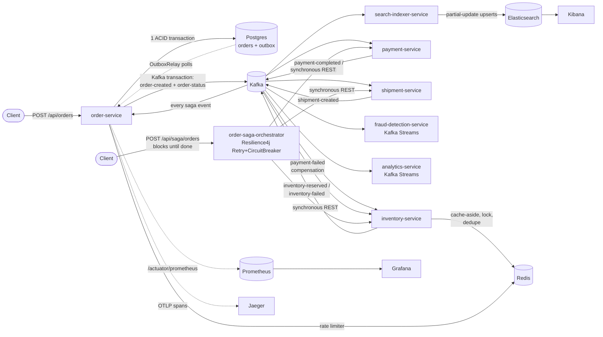
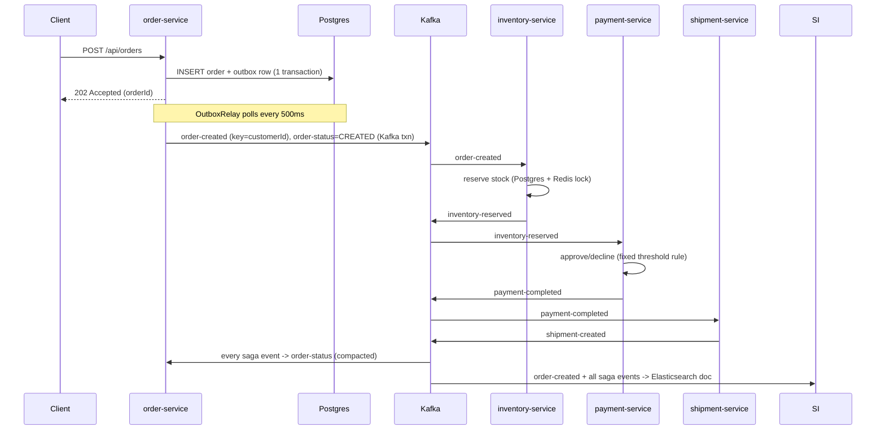

# OrderFlow — System Design Doc

Build Order Step 13. Everything below is written against the codebase as
it actually exists after Step 12, not as an aspirational target — every
claim here is either a link to real code, a link to a live-tested walk-
through in the root README, or (in the "Known gaps" section) an explicit
admission that something from `claude.md` was scoped out. If a sentence
here turns out to be wrong, the code is the source of truth, not this
document.

## 1. Purpose and scope

OrderFlow is a personal revision/portfolio project: a Spring Boot +
Kafka e-commerce order pipeline built specifically to exercise advanced
Kafka concepts and core distributed-systems design principles, not to be
a production e-commerce platform. That framing matters for every trade-
off below — several decisions here are deliberately the "teaching"
choice rather than the "production" choice (e.g. a single-broker Kafka
cluster, in-memory fraud rules instead of a real ML model, a
`FAKE_UNIT_PRICE` constant instead of a catalog service). Each is called
out explicitly where it applies.

## 2. Functional requirements

Derived from `claude.md` section 2 (Services to Build) and section 1
(domain description):

1. A client can place an order over REST and get an immediate,
   asynchronous acknowledgment (`order-service`).
2. Placing an order deterministically flows through: inventory
   check/reservation → payment → shipment, with each step able to fail
   and trigger compensation for prior steps.
3. Every order is scored for fraud risk in real time, independent of the
   main saga (`fraud-detection-service`).
4. Business metrics (orders/min, revenue by region) are computed
   continuously from the live event stream (`analytics-service`).
5. A client can query "everything about order X" in one call, including
   fields that don't exist on any single service's own database
   (`search-indexer-service` + Elasticsearch).
6. A client can query "what's the current status of order X" cheaply,
   without replaying the full event log (`order-status` compacted
   topic, and the Redis-backed idea documented but not built — see
   §8).
7. The system tolerates a consumer crashing or being redeployed without
   losing or duplicating work it hasn't finished.
8. The system tolerates a downstream dependency (Postgres, Kafka, a
   peer service) being briefly unavailable without silently dropping an
   order.

Not built: `notification-service` (send real/mock notifications) — see
§8. `claude.md`'s optional/stretch items (event-log audit index,
Debezium CDC as an alternative to the outbox) are discussed as
comparisons but also not built — see §7.6 and §8.

## 3. Non-functional requirements (and their honest status)

| Requirement | Status |
|---|---|
| At-least-once delivery for every async step | ✅ Built and demonstrated — see §6 |
| No message permanently blocks a partition (poison-message handling) | ✅ Retry topics + DLT, Build Order Step 4 |
| No double-processing of a redelivered message | ✅ Redis-backed idempotent-consumer dedupe, Build Order Step 9 |
| No overselling stock under concurrent reservation attempts | ✅ Redis distributed lock, verified live across two real inventory-service instances (Build Order Step 9) |
| Observability: metrics + traces for every service | ✅ Micrometer/Prometheus + OpenTelemetry/Jaeger, Build Order Step 11 |
| Rate limiting on the public API | ✅ Per-customer token bucket, Build Order Step 9 |
| Data durability across infra restarts | ✅ Postgres/Redis/Elasticsearch via named volumes; Kafka's own volume mount was BROKEN until Step 12 — see §7.9 |
| Horizontal scalability of stateless consumers | ✅ Demonstrated (inventory-service, 2 instances, live rebalance) — not load-tested under real throughput, see §8 |
| Throughput/latency SLAs, benchmarked | ⬜ Not measured. `claude.md` §4 Performance asks for "basic load testing... throughput benchmarks across different partition counts" — never run. Single-broker, single-laptop Docker Compose isn't a meaningful environment for this anyway; flagged as future work, not attempted here |
| Fault tolerance across broker failure (ISR/leader election) | ⬜ Not demonstrated. `replicas(1)` on every topic (see §7.9) — this project's single-broker KRaft cluster has zero replication, so there is no leader-election failover TO demonstrate without first standing up a 3-broker cluster, which is out of scope for a laptop tutorial |
| Automated test coverage | 🟡 Step 14: Testcontainers `CoreOrderFlowIntegrationTest` per choreography-saga service (order-service, inventory-service, payment-service, shipment-service), 6 tests, real Kafka/Postgres/Redis. Step 15: `TopologyTestDriver` unit tests for both Kafka Streams apps, 10 tests, no broker. Step 16: Testcontainers Kafka+Elasticsearch tests for search-indexer-service, 5 tests — including one that reproduces the Step 10 cross-topic-reordering bug directly as a passing assertion instead of only prose. Still ⬜: `order-saga-orchestrator` has no tests at all; no automated Avro contract test. See §8 |

## 4. High-level architecture

This is a trimmed version of the root README's diagram — see
[`README.md`](../README.md#target-architecture) for the full one
including `customer-profile`, both analytics output topics, and the
observability fan-out drawn per service. Two separate client entry
points exist ON PURPOSE: choreography (`order-service`) and
orchestration (`order-saga-orchestrator`) never touch the same order, so
they can be compared directly rather than one replacing the other.

## 5. Data flow: one order, start to finish (choreography path)

The client only ever waits for the first two arrows. Everything from
`OS->>K: order-created` onward happens after the 202 has already been
returned — this is the whole point of moving Kafka publishing off the
request thread in Build Order Step 5 (§7.5).

## 6. Requirements traceability — Kafka concepts (`claude.md` §3)

| Concept | Status | Where |
|---|---|---|
| Custom partitioning by key (customerId/region) | ✅ | `OutboxRelay.java` keys `order-created` by `customerId` — default hash partitioner, not a custom `Partitioner` class (see §8) |
| Idempotent producer | ✅ | `order-service/application.yml` sets `enable.idempotence: true` explicitly; every other producer inherits it from the Kafka client's own default (true since Kafka 3.0) — see §7.2 |
| `acks=all` vs `acks=1` compared | 🟡 | `acks=all` set explicitly on order-service; the comparison experiment (actually running both and observing the difference) was never performed — see §7.2 |
| Avro + Schema Registry | ✅ | All 8 services, `avro-schemas/`, Build Order Step 3 |
| Sync vs async sends with callbacks | 🟡 | Every producer uses `KafkaTemplate`'s async send; no explicit sync (`.get()`-blocking) example exists to contrast against |
| Producer interceptors (tracing headers) | ⬜ | Not built — OpenTelemetry's Java agent auto-instruments Kafka producers/consumers and injects trace headers itself (Build Order Step 11), which made a hand-written interceptor redundant for this project's actual tracing need |
| Consumer groups + horizontal scaling + rebalancing | ✅ | `inventory-service`, live-tested with 2 instances, Build Order Step 2 |
| Manual vs auto offset commit | ✅ | `inventory-service` uses manual (`AckMode.MANUAL`); other consumers use auto-commit, deliberately, once the concept was already taught once — see each service's `application.yml` comments |
| Static group membership | 🟡 | Explained in depth in `KafkaConsumerConfig.java`'s Javadoc; `group.instance.id` is never actually set anywhere in the repo — conceptually taught, not implemented |
| Consumer rebalance listeners | ✅ | `inventory-service/config/KafkaConsumerConfig.java` |
| Exactly-once vs at-least-once | ✅ | Kafka Streams apps (`fraud-detection-service`, `analytics-service`) run `exactly-once-v2`; every plain consumer/producer in the platform is at-least-once, made SAFE via idempotent-consumer dedupe (Redis) rather than exactly-once config — a deliberate, documented choice, not an oversight |
| Dead Letter Topics | ✅ | `inventory-service`, Build Order Step 4 |
| Retry topics with exponential backoff | ✅ | Same, `RetryTopicConfiguration`, 1s/2s/4s backoff |
| Batch listeners vs single-record | ⬜ | Every `@KafkaListener` in this codebase is single-record; no batch listener exists to compare against |
| Idempotent consumers (Redis dedupe) | ✅ | `inventory-service`, Build Order Step 9 |
| Stateless Kafka Streams transformations | ✅ | `fraud-detection-service`'s rule engine |
| Stateful aggregations (windowed, KTable) | ✅ | `analytics-service`, `fraud-detection-service`'s velocity check |
| KStream–KTable joins | ✅ | `fraud-detection-service` enriches orders with `customer-profile` (compacted topic) via `leftJoin` |
| Interactive queries | ✅ | Both Streams apps expose their state store over REST |
| Exactly-once-v2 | ✅ | Both Streams apps |
| Avro schema evolution | ✅ | Live-demonstrated both directions (backward-compatible add, and a rejected breaking change) — see root README's Step 3 walkthrough |
| Kafka transactions spanning topics | ✅ | `order-service`'s `OutboxRelay` — `order-created` + `order-status` published atomically |
| Outbox pattern | ✅ | Build Order Step 5, including a live-tested crash-resilience demo |
| Debezium/CDC as an alternative | 🟡 | Documented and compared in the root README's Step 5 section; not actually built (`kafka-connect` stays commented out in `docker-compose.yml`, on purpose, as a worked "here's what you'd add" example) |
| Retention vs. compacted topics | ✅ | `order-created` (retention) vs. `order-status` (compacted), same cluster, `KafkaTopicConfig.java` |
| Partition count / replication factor experiments | 🟡 | Every topic uses `partitions(3)`; `.replicas(1)` is the ONLY option on this project's single-broker cluster. No throughput comparison across different partition counts was run (see §3) |
| Kafka UI / AKHQ | ✅ | `docker-compose.yml`, `orderflow-kafka-ui` |
| Micrometer → Prometheus, incl. consumer lag | ✅ | Build Order Step 11, including a real gap found and fixed live (inventory-service's hand-built `ConsumerFactory` silently missing the lag binding) |
| Embedded Kafka / Testcontainers integration tests | ✅ | Build Order Step 14 — real Testcontainers-managed Kafka/Postgres/Redis (deliberately NOT Spring Kafka's embedded broker; see `CoreOrderFlowIntegrationTest`'s Javadoc for why that distinction mattered for reproducing Step 12's class of bug), one test class per saga service. See §8 for what's still untested |
| Contract tests for Avro compatibility | ⬜ | Compatibility was verified manually, live, via `curl` against Schema Registry's `/compatibility` endpoint (Step 3) — not automated as a repeatable test |

## 7. Trade-offs considered

### 7.1 Partitioning key: `customerId`, not `orderId`

`order-created` is keyed by `customerId` (`OutboxRelay.java`), not the
newly generated `orderId`. This trades ordering for aggregation: all of
one customer's orders land on the same partition, in order, which is
exactly what `fraud-detection-service`'s velocity check (Build Order
Step 6, "4 rapid orders from the same customer") depends on — a
per-order key would scatter one customer's orders across all 3
partitions and make that check impossible without a repartition. The
cost is a **hot-partition risk**: a single very-high-volume customer
(or an unlucky hash collision) concentrates load onto one partition,
capping that customer's own throughput at whatever one partition/one
consumer instance can handle, no matter how many total partitions or
consumer instances exist. `claude.md` §4 names salting/composite keys as
the standard fix; this project does not implement or demonstrate that
fix — flagged, not solved, consistent with how `KafkaTopicConfig.java`'s
own comment already frames the choice (see §8).

This same key choice was also the source of a real, live-found bug
(Build Order Step 6): `OutboxRelay` originally copy-pasted the
`order-status` send's `orderId` key onto the `order-created` send too,
silently breaking the per-customer ordering promise for the entire
Step 5 lifetime. Nothing in Step 5 depended on it, so nothing caught it
— Step 6's velocity check did, immediately, the first time it ran. The
lesson generalizes: a partition-key contract with no consumer that
actually depends on it is invisible to test until one exists.

### 7.2 Idempotent producer and `acks`

Only `order-service` sets `enable.idempotence: true` and `acks: all`
explicitly (`application.yml`). Every other producer in this platform
(`inventory-service`, `payment-service`, etc.) never sets either
property — and both are safe anyway, because Kafka's client defaults
have been `enable.idempotence=true` / `acks=all` since Kafka 3.0. This
project never actually ran the `acks=1` comparison `claude.md` asks for
(fewer round-trip guarantees, briefly higher throughput, at the cost of
possible message loss on an unclean leader failover) — with a
single-broker cluster and no throughput benchmarking (§3), there's
nothing to meaningfully measure yet. `order-service`'s explicit setting
is really about the OTHER thing idempotence unlocks for that service
specifically: it's the prerequisite for the transactional producer
`OutboxRelay` needs (§7.5), not a throughput decision.

### 7.3 Choreography vs. orchestration saga

Both are built and live-tested side by side rather than picking one —
see the root README's [full side-by-side
comparison](../README.md#choreography-vs-orchestration--compared-side-by-side)
for the complete table (coupling, failure handling, compensation
trigger, etc.). In one sentence: choreography trades explicit
visibility for zero coupling (Kafka topic names are the only shared
contract); orchestration trades coupling (one service now knows all
three downstream APIs) for a single, readable source of truth for "what
happens to an order" and synchronous failure handling via Resilience4j.
Neither is "correct" for every system — this project's whole point in
building both was to make that trade-off something verified by running
real compensation paths on each, not just asserted in a doc.

### 7.4 Exactly-once (Kafka Streams) vs. at-least-once + idempotent consumer (everything else)

`fraud-detection-service` and `analytics-service` run Kafka Streams'
`exactly-once-v2` — free once you opt in via `processing.guarantee`,
because Streams's transactional commit ties consumer-offset commits and
producer writes together atomically. Every plain `@KafkaListener`
consumer in this platform, by contrast, stays at-least-once: simpler
configuration, no transactional coordinator overhead per consumer, at
the cost of needing to handle redelivery explicitly. `inventory-service`
does exactly that with a Redis-backed dedupe store keyed by order ID
(Build Order Step 9) — the same safety property exactly-once gives you
automatically, achieved instead with an idempotency check the consumer
owns. This is a real architectural choice, not a shortcut: a Streams
topology's whole state lives inside the exactly-once transaction
boundary, but `inventory-service`'s side effects (a Postgres write, a
Redis lock, an HTTP-adjacent Kafka publish) span systems exactly-once-v2
was never designed to cover anyway.

### 7.5 The outbox pattern (and Debezium as the alternative)

Through Build Order Step 4, `order-service` published to Kafka directly
on the request thread — a classic dual-write: if the Postgres write and
the Kafka publish don't both succeed, you get either an order that was
never announced downstream, or an event for an order that doesn't
durably exist. Step 5's fix: the request thread touches ONLY Postgres
(one ACID transaction writes the order row and an outbox row together),
and a separate poller (`OutboxRelay`) publishes outbox rows to Kafka
inside a Kafka transaction, deleting each row only after a successful
publish. A live crash-resilience test (kill `order-service` between the
Postgres commit and the Kafka publish, then restart it) confirmed the
row survives and gets published on restart — see the root README's Step
5 section for the actual timestamps.

`claude.md` names Debezium CDC as an alternative implementation to
compare, not to necessarily build. This project documents that
comparison (root README, Step 5) rather than building it: CDC removes
the polling-interval latency and the `OutboxRelay` code entirely, at the
cost of operating a whole separate piece of infrastructure (Kafka
Connect + a Debezium connector reading Postgres's WAL) for what the
in-process poller already solves adequately at this scale. `kafka-connect`
stays commented out in `docker-compose.yml` specifically as a worked
example of what you'd add if you took that path instead.

### 7.6 CQRS and the dual-write problem, generalized to Elasticsearch/Redis

The SAME dual-write problem Section 7.5 describes for Postgres+Kafka
reappears anywhere a service tries to write to two different systems
from one request. `search-indexer-service` avoids it the same way
`OutboxRelay` does structurally, if not literally: it writes to
Elasticsearch ONLY from a Kafka consumer, never directly from
`order-service` or any saga participant — Kafka's own delivery
guarantees replace the need for a literal outbox table here, because the
write to Elasticsearch and the "fact that happened" (the Kafka message)
are already decoupled by construction. `inventory-service`'s Redis
cache-aside layer follows the same rule: Redis is invalidated by a Kafka
consumer reacting to a stock-change event, never written to directly by
the HTTP request path that changed the stock.

The cost, in both cases, is eventual consistency: a
`GET /api/search/orders` result can be a few hundred milliseconds stale
relative to Postgres, and if `search-indexer-service`'s consumer group
falls behind (see consumer lag, §6), that staleness grows — a genuine
UX concern `claude.md` §7 asks to be called out explicitly, not hidden.
This project surfaces it the honest way: by demonstrating it live (root
README's Step 10 section shows a freshly placed order absent from a
search result, then present a few seconds later) rather than adding a
version/timestamp field to the API response to communicate it formally
— the latter would be the production-grade fix, flagged here as future
work.

### 7.7 Retention vs. compacted topics

`order-created` (retention, default `cleanup.policy=delete`) and
`order-status` (`cleanup.policy=compact`) live in the same cluster,
keyed differently for different questions: the former is an immutable
log of "what happened, in order" — useful for replay, for every new
consumer that needs full history (search-indexer-service backfilling
via `earliest`, for instance). The latter only ever needs the LATEST
value per key — "what's true right now" for order X — so Kafka's log
cleaner can safely discard every superseded record forever, keeping the
topic's disk footprint proportional to the number of distinct orders,
not the number of status transitions ever emitted. Choosing retention
for a "current state" use case wastes disk without benefit; choosing
compaction for a "full history" use case silently loses the history you
needed. `KafkaTopicConfig.java` makes this a per-topic bean-level
decision precisely so it's a conscious choice each time, not a
cluster-wide default nobody revisits.

### 7.8 Distributed lock vs. optimistic concurrency for overselling

Two different projects in this repo solve the same class of problem
(concurrent writers racing the same resource) two different ways.
`inventory-service` reproduces genuine overselling with two real
instances hammering the same low-stock SKU, then fixes it with a Redis
distributed lock (`SETNX`-based, via a Lua script for atomicity) — a
pessimistic approach: only one writer can even attempt the critical
section at a time. `search-indexer-service` hits a structurally similar
problem (six independent Kafka listener threads racing to update the
SAME Elasticsearch document during a backfill) and solves it
optimistically instead — `withRetryOnConflict(3)` lets Elasticsearch's
own document versioning reject and retry losing writers, rather than
serializing access up front. Both are real, live-reproduced bugs before
they were real, live-verified fixes (Build Order Steps 9 and 10
respectively) — the choice of pessimistic vs. optimistic here tracked
which primitive the underlying store already offered cheaply (Redis
`SETNX` vs. Elasticsearch's built-in `_version`), not a universal rule
for which is "better."

### 7.9 A structural lesson from Step 12: verify infrastructure claims live, not by reading docs

Not a concept `claude.md` names directly, but the most concrete finding
of the whole project: `docker-compose.yml` had mounted a named volume to
`/var/lib/kafka/data` since Build Order Step 1, specifically so Kafka
topic data would survive container restarts — and it never actually
worked, for the entire project's lifetime, because `apache/kafka:3.8.0`'s
real log directory is `/tmp/kafka-logs`, a completely different,
unmounted path. Every `docker compose down` / `up -d` cycle before Step
12 silently started from zero topics; nothing in the project's own
testing had ever included a true cold restart, only `up -d` on top of
containers that were already running. Fixed with an explicit
`KAFKA_LOG_DIRS` override, then verified by recreating the Kafka
container a second time and confirming all 17 topics + registered Avro
schemas survived — see the root README's ["Running Step 12
yourself"](../README.md#running-step-12-yourself-full-docker-compose-verified-cold)
for the full found-live/fixed-live walkthrough. The general lesson this
leaves behind: a volume mount that "looks right" in a compose file is a
claim about the image's internals, not a guarantee — the only way to
know it actually persists is to tear the container down and check.

## 8. Known gaps (deliberately not built, stated plainly)

- **Automated test coverage is now partial, not absent.** Build Order
  Step 14 added a Testcontainers `CoreOrderFlowIntegrationTest` per
  choreography-saga service — order-service, inventory-service,
  payment-service, shipment-service — covering the happy path and the
  payment-declined compensation path against real Kafka/Postgres/Redis
  (6 tests). Step 15 added `TopologyTestDriver`-based unit tests for
  both Kafka Streams apps — `fraud-detection-service` (both branches:
  the leftJoin-vs-inner-join behavior, severity escalation, the exact
  threshold-crossing point of the windowed velocity count) and
  `analytics-service` (`.groupBy(...)` genuinely re-keying into
  independent buckets, windows genuinely resetting instead of
  accumulating) — 10 tests, no broker at all, milliseconds per test.
  Step 16 added real Testcontainers Kafka+Elasticsearch tests for
  `search-indexer-service` (5 tests) — including one that doesn't just
  add new coverage but turns an ALREADY-documented, deliberately-unfixed
  bug (the cross-topic reordering gap from Step 10) into a real,
  reproducible, passing assertion instead of leaving it as only prose in
  a README. Still genuinely a gap, stated plainly: `order-saga-orchestrator`
  has NO tests at all; and the manual `curl` checks against Schema
  Registry's `/compatibility` endpoint from Step 3
  were never turned into an automated contract test. Most other
  "verified live" claims in this project remain exactly that — a manual
  check performed once during development, not a regression test that
  runs again on the next change.
- **`notification-service` was never built.** Still drawn as ⬜ in the
  root README's architecture diagram. Every other consumer of the
  platform's events exists; this one doesn't, simply because nothing
  downstream of it depends on its existence the way, say,
  `search-indexer-service` depends on all 6 topics it reads.
- **Hot-partition simulation + fix (salting/composite key) is discussed,
  not demonstrated.** `KafkaTopicConfig.java`'s comments previously
  pointed at a "Section 4 of the root README" and an "ISR / leader
  election" section that never actually existed — a real inconsistency
  between what the code promised and what got written. Fixed as part of
  writing this doc: those comments now point here instead of a page that
  doesn't exist.
- **ISR / leader election / broker-failure simulation is not
  demonstrated**, for the structural reason that this project's
  single-broker KRaft cluster has `replicas(1)` on every topic — there
  is no second replica to fail over TO. Demonstrating this meaningfully
  needs a 3-broker compose stack, out of scope for what's currently a
  single-container Kafka setup.
- **No throughput benchmarking across partition counts or replication
  factors** — `claude.md` §4 asks for this explicitly; never run,
  same single-broker/single-laptop constraint as above.
- **Static group membership (`group.instance.id`) and batch listeners**
  are both explained in code comments but never actually configured or
  implemented anywhere in the 8 services.
- **No custom `Partitioner` implementation** — partitioning by
  `customerId` uses Kafka's default hash partitioner on a chosen key,
  which achieves the "same customer, same partition" goal without
  needing custom partitioning logic; a genuinely custom `Partitioner`
  class (e.g. for the salting fix above) was never written.
- **REST-layer idempotency (safe order-placement retries) is a
  documented, live-demonstrated gap, not a silent one** — `order-service`'s
  own controller Javadoc and "TRY IT YOURSELF" section show that firing
  the same `POST /api/orders` twice produces two different `orderId`s
  today; an `Idempotency-Key` header is named as the fix and explicitly
  not implemented.
- **The Elasticsearch cross-topic reordering bug from Step 10 stays
  unfixed** (documented in `search-indexer-service/README.md`): a cold
  consumer-group replay can, in principle, process `shipment-created`
  before `order-created` for the same order (Kafka only orders within a
  topic-partition, never across topics), regressing that order's indexed
  status backward. The professional fix — a Painless scripted
  conditional update comparing timestamps — is named, not built.

## 9. Where to go for more detail

- [`README.md`](../README.md) — the full Build Order, live-tested
  walkthroughs for every step (real captured command output, not
  hypothetical), and the complete architecture diagram.
- Every module's own `README.md` — a "What this module demonstrates"
  table mapping concepts to exact files, plus hands-on exercises.
- [`docs/git-github-workflow.md`](git-github-workflow.md) — the
  branch/PR/merge workflow this project's own history was built with,
  using real commits as worked examples.
